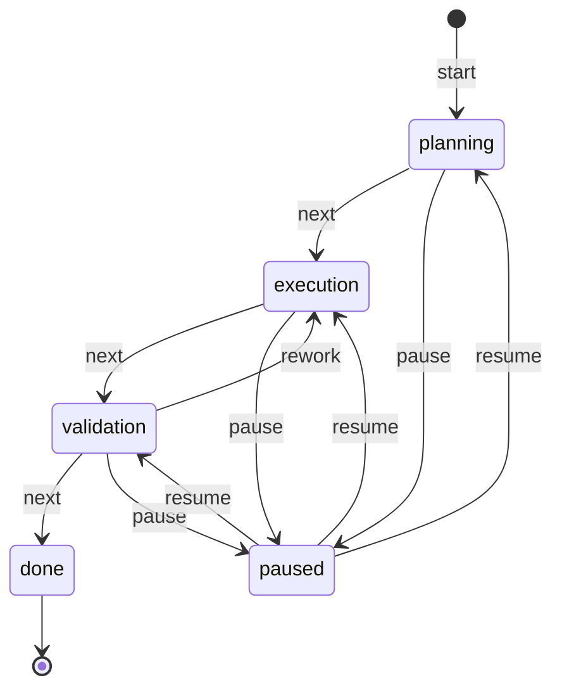

# llm-bot

A provider-agnostic Python client for OpenAI-compatible LLM APIs, extended with
an **agent layer**. Beyond single prompts, it supports multiple LLM providers,
named agents (roles), and persistent multi-turn chat sessions that keep their
own message history.

Architecture layers:

- [`LLMClient`](llm_bot/client.py) — transport: HTTP, retries, auth, payload.
- [`Agent`](llm_bot/agent.py) — a role: system prompt, temperature, max tokens,
  and a reference to a model profile.
- [`Session`](llm_bot/agent.py) — a conversation with an agent; owns its message
  history and persists it to disk.
- Storage backends ([`stores.py`](llm_bot/stores.py)) — pluggable repositories
  for models, agents and sessions (YAML/JSON today, a database later).

This design keeps the console UI ([`cli.py`](llm_bot/cli.py)) thin and makes it
trivial to add a **web interface** later without touching the logic.

## Features

- Provider-agnostic — works with OpenAI, Ollama, LM Studio, LocalAI, GigaChat,
  and any other server exposing the `/v1/chat/completions` endpoint.
- **Multiple providers** — model credentials live in `data/models.yaml`, so you
  can define any number of LLM profiles.
- **Named agents** — roles defined in `data/agents.yaml` (system prompt,
  temperature, max tokens) that reference a model profile.
- **Personalization profiles** — orchestration config in `data/profiles.yaml`
  (style, format, expertise, constraints) composed onto an agent at session
  creation (`--profile developer`); memory is never touched by profiles
  (see "Profiles (personalization)" below).
- **Persistent chat sessions** — each conversation keeps its own history in
  `data/sessions/*.json` and survives process restarts.
- Automatic retries with exponential backoff for transient failures
  (timeouts, network errors, HTTP 429 / 5xx).
- Clear error handling via custom exception types.
- Console entry point: interactive chat (`--agent`) or a single prompt.
- `--details` flag to print request/response diagnostics (URL, model, formed
  request body, token usage, per-attempt timing) to stderr.
- Built-in GigaChat support with automatic OAuth2 token acquisition and refresh.
- **Context compression** — rolling-summary keeps long dialogs inside the token
  budget: recent turns stay verbatim, older ones fold into a running summary that
  is injected at the front of each request (see "Context compression" below).
- **Pluggable context strategies** — three alternative ways to manage context
  *without* summary, all selectable per-agent or per-session (`--strategy`):
  sliding window / sticky facts (key-value durable memory) / branching
  (see "Context strategies" below).
- **Invariants (hard constraints)** — owner-declared architecture/decision/stack/
  business rules stored separately from the dialog (`data/invariants.yaml` +
  per-session entries); injected into every request and enforced by a
  deterministic regex gate BEFORE anything is sent, with self-explaining
  refusals (see "Invariants" below).
- **Task state machine** — the work on a task is formalized as a finite-state
  machine (stage `planning → execution → validation → done` + `paused`, current
  step, expected action). The stage is recognized from the dialog by a small
  LLM call or driven manually via `/task` commands; the snapshot is persisted
  with the session and injected into the system context on every turn, so
  after a pause or a process restart a bare «продолжай» is enough
  (see "Task state machine" below).
- **Comparison scripts** — reproducible experiments (`scripts/compare_compression.py`,
  `scripts/compare_context_strategies.py`) comparing answer quality and token spend
  across strategies.
- Pytest suite using `httpx.MockTransport` (no network needed).

## Project structure

```
llm-bot/
├── llm_bot/
│   ├── __init__.py            # package exports
│   ├── config.py              # LLMConfig — settings from env vars
│   ├── diagnostics.py         # RequestDetails/ResponseDetails + listener protocol
│   ├── client.py              # LLMClient — transport + retries + errors + detail events
│   ├── compress.py            # ContextCompressor + CompressionSettings (rolling summary)
│   ├── context_strategies.py  # SlidingWindow / StickyFacts / Branching (pluggable strategies)
│   ├── task_state.py          # TaskStateMachine: formal task stage/step/action FSM
│   ├── invariants.py          # Invariant/InvariantRegistry: hard constraints + gate
│   ├── profiles.py            # apply_profile: compose ProfileConfig onto AgentConfig
│   ├── stores.py              # Repository interfaces (ModelStore/AgentStore/ProfileStore/SessionStore)
│   ├── yaml_stores.py         # YamlModelStore / YamlAgentStore / YamlProfileStore (data/*.yaml)
│   ├── json_session_store.py  # JsonSessionStore (data/sessions/*.json)
│   ├── agent.py               # Agent (role) + Session (conversation with history)
│   ├── factory.py             # Wiring: assemble client/agent/session from stores
│   ├── gigachat.py            # GigaChat OAuth2 token provider + factory
│   ├── cli.py                 # console entry point (interactive chat / single prompt)
│   └── __main__.py            # enables `python -m llm_bot`
├── scripts/
│   ├── compare_compression.py       # token/quality experiment: with vs without compression
│   ├── compare_context_strategies.py# strategies on a shared "ТЗ" scenario
│   └── ...                          # other comparison/demo scripts
├── tests/
│   ├── test_client.py         # LLMClient tests (mocked transport)
│   ├── test_agent.py          # Agent + Session tests
│   ├── test_compress.py       # context-compression tests
│   ├── test_task_state.py     # task state machine tests
│   ├── test_compare_compression.py
│   ├── test_stores.py         # YAML/JSON store tests
│   └── test_gigachat.py       # GigaChat token provider tests
├── results/                   # experiment reports (markdown)
├── models.example.yaml        # template -> copy to data/models.yaml
├── agents.example.yaml        # template -> copy to data/agents.yaml
├── invariants.example.yaml    # template -> copy to data/invariants.yaml
├── requirements.txt
├── .env.example
└── README.md

data/                          # runtime data — DO NOT COMMIT (see .gitignore)
├── models.yaml                # real provider credentials
├── agents.yaml                # real agent definitions
└── sessions/                  # per-session chat histories (*.json)
```

## Installation

Requires Python 3.10+.

```bash
cd llm-bot
python -m venv .venv
# Windows:
.venv\Scripts\activate
# macOS/Linux:
source .venv/bin/activate

pip install -r requirements.txt
```

## Configuration

Copy `.env.example` to `.env` and edit it:

```bash
cp .env.example .env   # Windows: copy .env.example .env
```

| Variable             | Default                 | Description                                              |
| -------------------- | ----------------------- | -------------------------------------------------------- |
| `LLM_BASE_URL`       | `https://api.openai.com/v1` | Base URL of the chat-completions API                |
| `LLM_API_KEY`        | *(empty)*               | API key (leave empty for local providers)                |
| `LLM_MODEL`          | `gpt-4o-mini`           | Model identifier                                         |
| `LLM_MAX_RETRIES`    | `3`                     | Retries for transient failures                           |
| `LLM_RETRY_BACKOFF`  | `1.0`                   | Base backoff seconds (exponential: `backoff * 2^n`)      |
| `LLM_TIMEOUT`        | `30`                    | Request timeout in seconds                               |
| `LLM_SYSTEM_PROMPT`  | *(empty)*           | Optional system prompt sent before the user prompt (e.g. to request a JSON response format) |
| `LLM_DEFAULT_SYSTEM_PROMPT` | *(empty)*   | Optional **base** system prompt that is always prepended to any other system prompt (`LLM_SYSTEM_PROMPT`, expert roles, etc.). Set it to keep replies in the user's language by default. Leave empty to disable. |
| `LLM_MAX_RESPONSE_WORDS` | *(empty)*           | Target maximum reply length in words; adds a briefness instruction to the system prompt (empty = no limit). Per-invocation via `--max-response-words`. |
| `LLM_MAX_TOKENS`         | *(empty)*           | Hard cap on generated tokens per reply, enforced by the API (`max_tokens` in the payload). Empty = provider default. |

### Example: use a local Ollama server

```bash
# .env
LLM_BASE_URL=http://localhost:11434/v1
LLM_API_KEY=
LLM_MODEL=llama3.2
```

### Example: GigaChat (Sber)

GigaChat exposes an OpenAI-compatible endpoint, but requires an OAuth2 token
exchange before each session. The client handles this automatically via
`--provider gigachat`: it exchanges your credentials for an access token, caches
it, and refreshes it when it expires (~30 min).

```bash
# .env
LLM_BASE_URL=https://gigachat.devices.sberbank.ru/api/v1
LLM_MODEL=GigaChat-2-Max
GIGACHAT_CLIENT_ID=your-client-id
GIGACHAT_CLIENT_SECRET=your-client-secret
GIGACHAT_SCOPE=GIGACHAT_API_PERS
```

Then run with:

```bash
python -m llm_bot --provider gigachat "Привет! Расскажи о себе"
```

> **Note:** if your Sber credentials only provide a `client_secret` (no separate
> client id), set `GIGACHAT_CLIENT_SECRET` and leave `GIGACHAT_CLIENT_ID` empty,
> or provide a pre-encoded `GIGACHAT_BASIC_AUTH="Basic ..."` if your variant
> differs from `base64(client_id:client_secret)`.

## Models, agents and sessions

The agent layer uses three separate definitions:

1. **Models** (`data/models.yaml`, key `models`) — provider credentials only
   (`base_url`, `api_key`, `model`, optional GigaChat OAuth fields). No behaviour.
2. **Agents** (`data/agents.yaml`, key `agents`) — a role: which model to use,
   the system prompt, temperature and `max_tokens`. Many agents can share one
   model profile while differing in behaviour.
3. **Sessions** (`data/sessions/*.json`) — a conversation with an agent, owning
   its own message history. Sessions are created at runtime, not defined in YAML.

Create the real files from the templates (they are **not** committed):

```bash
mkdir -p data/sessions
cp models.example.yaml data/models.yaml
cp agents.example.yaml data/agents.yaml
cp .env.example .env
```

Secrets in `data/models.yaml` are referenced as `${ENV_VAR}` and resolved from
the environment / `.env`, so real keys never need to be committed. Keep `data/`
out of version control (it is listed in `.gitignore`).

Example `data/models.yaml`:

```yaml
models:
  openai-gpt4o:
    provider: openai
    base_url: https://api.openai.com/v1
    api_key: ${OPENAI_API_KEY}
    model: gpt-4o-mini
  ollama-local:
    provider: openai
    base_url: http://localhost:11434/v1
    api_key: ""
    model: llama3.2
```

Example `data/agents.yaml` (two agents sharing the same model profile):

```yaml
agents:
  translator:
    model: openai-gpt4o
    system_prompt: "Переводи с русского на английский и обратно."
    temperature: 0.2
    max_tokens: 512
  critic:
    model: openai-gpt4o
    system_prompt: "Давай строгий критический разбор текста."
    temperature: 0.9
```

List available agents:

```bash
python -m llm_bot --list-agents
```

## Profiles (personalization)

Profiles answer "HOW should the agent behave for THIS user/task" — the third
config layer. The separation of concerns is strict:

| Layer | File | Answers |
|---|---|---|
| Transport | `data/models.yaml` | which API and how to call it |
| Role | `data/agents.yaml` | who the agent is (role, defaults) |
| **Profile** | `data/profiles.yaml` | how to answer THIS user (style, format, constraints) |
| Memory | `data/memory/` | what was learned from the dialog (facts, decisions) |

A profile is **orchestration config, not memory**: it is declared in YAML like
agents and models, applied once at session creation by
[`apply_profile`](llm_bot/profiles.py) (system-prompt directives +
`max_response_words`/`temperature` overrides), and never written to or read
from the memory layers.

Create the file from the template:

```bash
cp profiles.example.yaml data/profiles.yaml
```

Then personalize a chat (the launch command you already use, plus one flag):

```bash
python -m llm_bot --agent assistant --profile developer   # terse, technical, code-first
python -m llm_bot --agent assistant --profile student     # step-by-step, friendly
python -m llm_bot --agent assistant                       # unchanged, no profile
```

Inspect profiles without chatting:

```bash
python -m llm_bot --list-profiles            # all profiles with settings
python -m llm_bot --show-profile developer   # one profile + its generated prompt block
```

Unknown profile names fail fast with the list of available ones — the same
behaviour as unknown agents.

Verify that different profiles give observably different answers to the SAME
question (writes `results/compare_profiles.md` + `.json`):

```bash
python scripts/compare_profiles.py --profiles developer,student,child
python scripts/compare_profiles.py --include-none   # add a no-profile baseline row
```

Programmatic composition (no CLI needed):

```python
from llm_bot.profiles import apply_profile
from llm_bot.stores import AgentConfig, ProfileConfig
from llm_bot.yaml_stores import YamlProfileStore

agent = AgentConfig(name="assistant", model="gpt4o",
                    system_prompt="Ты полезный помощник.")
profile = YamlProfileStore().get("developer")
personalized = apply_profile(agent, profile)
```

## Usage

### Interactive chat with an agent

Start an interactive chat with the `assistant` agent (history is saved to
`data/sessions/` and resumes with the same `--session` id):

```bash
python -m llm_bot --agent assistant
python -m llm_bot --agent assistant --session my-conversation   # resume
```

Inside the interactive chat, type `/history` (or `/история`) to print all
previous messages of the current session; `exit`/`quit`/Ctrl-D leave the chat.

When you resume an existing session (with `--session`), the CLI prints a
`[session]` line to stderr with how much context is loaded: the number of
messages in the history and, depending on the active context strategy, the
sliding-window size (`окно`), the sticky-fact count (`фактов`), or the list of
dialogue branches with the current one marked (`ветки [<current>]: ...`). A
rolling-compression summary is reported as `summary: N симв.`.

A single one-shot turn via an agent:

```bash
python -m llm_bot --agent translator "Good morning"
```

A personalized turn — same agent, different behaviour via a profile
(see "Profiles (personalization)" above):

```bash
python -m llm_bot --agent assistant --profile student "Объясни рекурсию"
python -m llm_bot --agent assistant --profile developer --session dev1   # resumes a session too
```

### Legacy: single direct call

Prompt as an argument:

```bash
python -m llm_bot "Explain what an API is in one sentence."
```

Prompt piped via stdin:

```bash
echo "Summarize this text..." | python -m llm_bot
```

Override settings per-invocation:

```bash
python -m llm_bot --base-url http://localhost:11434/v1 --model llama3.2 "Hello"
python -m llm_bot --model gpt-4o-mini --verbose "Tell me a joke"
```

### Inspecting request/response details

Pass `--details` to see exactly what is sent and how the API responds. Details go
to **stderr**, so the reply on stdout stays clean:

```bash
python -m llm_bot --details "Hello"
```

```
[details] POST https://api.openai.com/v1/chat/completions
[details] model: gpt-4o-mini
[details] request body:
           {
             "model": "gpt-4o-mini",
             "messages": [
               {"role": "user", "content": "Hello"}
             ]
           }
[details] attempt 1: HTTP 200 in 320ms
[details] usage: prompt_tokens=8 completion_tokens=5 total_tokens=13
```

- The printed URL is where the request goes; the model and the fully formed
  request body are shown verbatim (the `Authorization` header is never printed,
  so API keys stay safe).
- On retries, each attempt is reported (`attempt 1`, `attempt 2`, ...) with its
  HTTP status and round-trip time.
- Token usage appears only when the provider reports it (OpenAI does; some local
  servers omit it).

### Enforcing a specific JSON response format

Use a system prompt to tell the model exactly how to format its reply. It can be
set per-invocation with `--system-prompt` or globally via `LLM_SYSTEM_PROMPT`:

```bash
python -m llm_bot \
  --system-prompt 'Отвечай строго в формате JSON со схемой {"answer": string, "summary": string}' \
  "Summarize the provided text"
```

When no system prompt is set, no `system` message is included in the request.

Exit codes:

- `0` — success
- `1` — the LLM call failed (after retries)
- `2` — invalid usage (no prompt provided)

## Tests

Run the mocked test suite (no live API required):

```bash
python -m pytest tests/ -v
```

Coverage includes: successful request, retry-then-success, rate limiting,
network errors, exhausted retries, permanent HTTP errors, unexpected response
shapes, config overrides, and the detail-listener events (request url/model/payload,
token usage, per-attempt reporting).

## Programmatic use

### Via an agent session

Assemble an agent from the stores and chat with it. The session keeps its own
history (persisted to `data/sessions/`), so multi-turn context is automatic:

```python
from llm_bot.factory import make_session
from llm_bot.json_session_store import JsonSessionStore
from llm_bot.yaml_stores import YamlAgentStore, YamlModelStore

session = make_session(
    "my-session",                     # session id (resume with the same id)
    "translator",                     # agent name from data/agents.yaml
    model_store=YamlModelStore(),
    agent_store=YamlAgentStore(),
    session_store=JsonSessionStore(),
)

reply = session.chat("Good morning")  # returns only the text
print(reply)
print(session.history)                # [user, assistant, ...] full transcript
```

An `Agent` is a stateless role; many sessions can share it. History lives on the
session, so different topics or users get independent conversations.

### Direct low-level call (`LLMClient`)

For a single prompt without any agent/session state:

```python
from llm_bot.client import LLMClient, LLMError
from llm_bot.config import LLMConfig

config = LLMConfig.from_env()          # reads .env / environment
client = LLMClient(config)

try:
    answer = client.send_prompt("Hello!")
    print(answer)
except LLMError as exc:
    print("Failed:", exc)
```

To send a pre-built message stack (e.g. a conversation history assembled by the
caller), use [`LLMClient.chat(messages)`](llm_bot/client.py) instead of
`send_prompt`.

For GigaChat, use the factory which wires up the OAuth2 token provider for you:

```python
from llm_bot.config import LLMConfig
from llm_bot.gigachat import build_gigachat_client

config = LLMConfig.from_env()
client = build_gigachat_client(config)  # auto obtains + refreshes the token
print(client.send_prompt("Привет!"))
```

To capture request/response details programmatically, pass a `detail_listener`
that implements the `DetailListener` protocol (URL, model, payload on
`on_request`; status, token usage, timing, attempt on `on_response`):

```python
from llm_bot.client import LLMClient
from llm_bot.config import LLMConfig
from llm_bot.diagnostics import RequestDetails, ResponseDetails

class Printer:
    def on_request(self, d: RequestDetails) -> None:
        print(d.method, d.url, d.model, d.payload)
    def on_response(self, d: ResponseDetails) -> None:
        print(d.status_code, d.usage, d.elapsed_ms, d.attempt)

client = LLMClient(LLMConfig.from_env(), detail_listener=Printer())
print(client.send_prompt("Hello"))
```

## MCP connection

The project includes a minimal **MCP (Model Context Protocol) client** that
connects to a ready-made MCP server and prints its tool catalog
([`scripts/mcp_list_tools.py`](scripts/mcp_list_tools.py), covered by
[`tests/test_mcp_list_tools.py`](tests/test_mcp_list_tools.py); verification
log in [`results/mcp_verification.md`](results/mcp_verification.md)).

```bash
# Local stdio server (default): the mcp-server-time reference server
python scripts/mcp_list_tools.py
# protocol : 2025-11-25
# server   : mcp-time 1.30.0
# tools    : 2
#   - get_current_time   (arg timezone: string, required)
#   - convert_time       (args source_timezone, time, target_timezone)

# Another local stdio server
python scripts/mcp_list_tools.py --command mcp-server-fetch

# Remote server over Streamable HTTP
python scripts/mcp_list_tools.py --url https://mcp.deepwiki.com/mcp
```

How it works: the client spawns the server as a child process and speaks MCP
over stdin/stdout (`stdio_client`), or opens a Streamable HTTP connection
(`streamablehttp_client`); then it performs the `initialize` handshake and
calls `tools/list`. Exit code 0 = connection OK. Dependencies: `mcp`
(official SDK) and `mcp-server-time` — both in [`requirements.txt`](requirements.txt).

Ready-made servers to point the client at:

| Server | How to run / endpoint | Tools |
| --- | --- | --- |
| `mcp-server-time` | `pip install mcp-server-time` (default) | `get_current_time`, `convert_time` |
| `mcp-server-fetch` | `pip install mcp-server-fetch` | `fetch` (URL → markdown) |
| `mcp-server-git` | `pip install mcp-server-git` | `git_status`, `git_log`, `git_diff`, … |
| `mcp-server-memory` | `pip install mcp-server-memory` | knowledge-graph memory tools |
| `@modelcontextprotocol/server-filesystem` | `npx @modelcontextprotocol/server-filesystem <dir>` (Node.js) | sandboxed file read/write |
| DeepWiki | `https://mcp.deepwiki.com/mcp` | repo documentation Q&A |
| Context7 | `https://mcp.context7.com/mcp` | library documentation lookup |

## Own MCP server: notes-CRM + agent tool use

The project ships its **own MCP server** around a small API — a mock-CRM of
notes kept in a JSON file — and an agent integration that calls it
(verification report: [`results/mcp_notes_verification.md`](results/mcp_notes_verification.md)).

- [`llm_bot/notes_api.py`](llm_bot/notes_api.py) — the mock-CRM API
  (`add_note` / `list_notes` / `find_notes`) over `NOTES_DB`
  (default `data/notes.json`).
- [`scripts/notes_mcp_server.py`](scripts/notes_mcp_server.py) — FastMCP
  stdio server registering the three tools with typed parameter schemas and
  text results.
- [`llm_bot/mcp_tools.py`](llm_bot/mcp_tools.py) — `MCPToolBridge` (one
  connection per server) and `MCPRouter` (aggregated catalog, `server__tool`
  namespacing, per-server failure isolation).

Agent integration uses a **prompt protocol** (the transport speaks plain
chat-completions): the router injects a system block advertising the tools;
when the model needs one it replies `{"call_tool": {"name": ..., "arguments":
{...}}}` — or a batch `{"call_tool": [{...}, ...]}` when one request needs
several actions. The session executes the call(s) over MCP, feeds the
results back as a service turn and the model produces the final answer
(rounds bounded by `mcp_max_rounds`; a batch costs one round). Each
round-trip is recorded in `session.mcp_events` and printed as `[mcp] ...`
lines on stderr. MCP is opt-in: without `--mcp` the feature is off even when
`data/mcp.yaml` exists, and an explicit `--mcp` with a broken/missing setup
fails with a clean one-line error instead of a traceback.

```bash
cp mcp.example.yaml data/mcp.yaml    # server list (stdio command or HTTP url)

python -m llm_bot --list-mcp                                   # catalog check
python -m llm_bot --agent assistant --mcp notes \
    "запиши заметку: купить корм коту, тег покупки"            # one-shot use
python scripts/mcp_notes_demo.py                               # live 2-turn demo
```

Adding more MCP servers is config-only — new entries in `data/mcp.yaml`
(e.g. `mcp-server-time` or `https://mcp.deepwiki.com/mcp`) selected with
`--mcp notes,time` / `--mcp all`.

## Token accounting and context limits

The agent counts tokens on every turn and can refuse to send a request that would
overflow the model's context window. For each user message it tracks:

* **request** — tokens for the current user message alone;
* **history** — tokens for the whole prior dialog (system prompt + all past turns);
* **context** — the full stack actually sent to the model (history + request);
* **reply** — tokens the model spent on its answer.

When the provider reports token `usage` (OpenAI does; some local servers do not)
the authoritative numbers replace the local estimates; otherwise a deterministic
`chars/4` estimate plus a per-message overhead is used, so counting always works
offline and for any provider.

* `Session.chat_with_details()` returns a `ChatResult` with a `TokenUsage`
  snapshot; `Session.last_usage` holds the most recent turn's numbers.
* The interactive CLI and one-shot agent calls print `[tokens ...]` to stderr
  after each reply.
* If the assembled context exceeds the model's `context_window`, a
  `ContextOverflowError` is raised **before** anything is sent — the caller must
  trim history or start a new session.
* Some providers impose a **hard per-request token ceiling** from the account
  tier (e.g. Groq's `on_demand` tier refuses any single request above its TPM
  cap even with a full rate-limit bucket — retrying can never help). Set
  `max_request_tokens:` per model (or `LLM_MAX_REQUEST_TOKENS` globally) and the
  agent blocks such requests up front with a `ContextTooLargeError`. A provider
  HTTP 413 whose body reports `Requested > Limit` is also mapped to this error.

Two independent budgets apply — the effective ceiling is the smaller of the
model's `context_window` and the account `max_request_tokens`:

* model window → `context_window` (`ContextOverflowError`);
* account per-request size cap → `max_request_tokens` (`ContextTooLargeError`).

Set both per model in `data/models.yaml` (`context_window:`,
`max_request_tokens:`) or globally via `LLM_CONTEXT_WINDOW` /
`LLM_MAX_REQUEST_TOKENS` (see `.env.example`).

```bash
# Interactive chat; token stats appear on stderr after each reply
.venv/bin/python -m llm_bot --agent assistant

# Offline demo: short vs long vs account-limit vs overflowing dialogs, token
# growth and the failures, using a fake transport (no API key needed)
.venv/bin/python scripts/token_demo.py
.venv/bin/python scripts/token_demo.py --context-window 400 --max-request-tokens 200
```

### Context strategies (without summary)

Besides rolling-summary compression, you can manage context with one of three
**pluggable strategies** that never build an LLM summary. They share a single
code path (`Session` + `Agent.build_messages`) and are selected per-agent (in
`data/agents.yaml`) or per-session via `--strategy`:

| Key        | Strategy                | What is sent to the model                     | Loss? |
|------------|-------------------------|-----------------------------------------------|-------|
| `sliding`  | Sliding Window          | Only the last `context_window_messages` msgs  | early details drop out of the reply |
| `facts`    | Sticky Facts / KV memory| A durable `facts` block + last N messages     | none (memory keeps details) |
| `branching`| Branching               | Full history of the active branch             | none (per branch) |

All three keep the **full** history on disk (in `data/sessions/*.json`); they only
trim what reaches the model. Nothing is deleted from persistent storage.

**Sliding window** — cheap and predictable; pick a `context_window_messages` that
fits the task:
```bash
python -m llm_bot --agent assistant --strategy sliding --window-messages 8
```

**Sticky facts** — the agent maintains a key/value `facts` block (goal, constraints,
preferences, decisions, agreements), refreshed after every turn by a small LLM call,
and sends `facts` + the last N messages. Details survive a small window at the cost
of extra tokens for the refresh:
```bash
python -m llm_bot --agent assistant --strategy facts --window-messages 8
```

**Branching** — fork the dialog into independent lines. `/branch <name>` snapshots
the current position as an automatic checkpoint and starts a new branch; `/switch`
moves between branches; `/branches` lists them:
```
> /branch web          # создаст ветку 'web' от текущей точки (checkpoint автоматически)
> В ТЗ добавить веб-интерфейс
> /switch main         # вернуться к основной линии
```
Each branch keeps its own full history and persists across restarts.

Config example (`data/agents.yaml`):
```yaml
assistant-sliding:
  model: openai-gpt4o
  system_prompt: "Ты полезный помощник."
  context_strategy: sliding
  context_window_messages: 8
```

A reproducible comparison on a shared "ТЗ" scenario is available:
```bash
python scripts/compare_context_strategies.py
```
and its analysis is in [`results/context_strategies_analysis.md`](results/context_strategies_analysis.md).

### Task state machine

The work on a task is formalized as a **finite-state machine**
([`task_state.py`](llm_bot/task_state.py)) with three axes:

* **stage** — the pipeline `planning → execution → validation → done`
  enforced by a transition table (`done` is terminal; there are **no**
  `planning → done` / `execution → done` edges, so a final without validation
  is impossible even for the model);
* **step** — what is being done right now;
* **expected_action** — what should happen next.

`paused` is a first-class state reachable from *any* non-terminal stage; it
remembers the originating stage, so resume returns the machine exactly where
it was.



Two ways to drive the machine:

* **auto-detect** (default) — after every turn a small LLM call recognizes a
  task being set from the dialog, stage hints, and pause/resume phrases
  (same technique as memory auto-extraction). A legal hint moves the machine
  *exactly* to the hinted stage (`move_to`); a classifier failure never
  breaks the turn.
* **manual** — slash-commands take priority over auto-detection:

```text
/task                      — status: stage, pause, step, expected action
/task start <описание>     — start a task (stage = planning)
/task step <текст>         — set the current step
/task action <текст>       — set the expected action
/task next [заметка]       — advance to the next pipeline stage
/task rework [причина]     — validation → execution (fix defects)
/task pause                — pause from any stage
/task resume               — continue (no re-explanation needed)
/task reset                — drop the task state
```

Enable with `--task-state` (CLI override) or `task_state: true` in
`data/agents.yaml`; `--no-task-detect` disables the automatic LLM call.

The snapshot (stage / step / expected action / log) is persisted with the
session (`task_state` key in `data/sessions/<id>.json`) and **injected as a
system message into every request**. This is what makes the two key
requirements work:

* **pause at any stage** — `/task pause` from planning, execution or
  validation (not from `done`; pausing an already-paused task is rejected,
  so no duplicate log entries);
* **continue without re-explaining** — after a pause *or a process restart*,
  a fresh session restores the snapshot from the store and the model sees the
  full task state, so a bare «продолжай» is enough.

Pause is enforced on **two levels**:

1. **Prompt directive** — while paused, the injected block carries a strict,
   non-contradictory instruction («работа ПРИОСТАНОВЛЕНА — не выполняй шаги
   задачи и не предлагай следующие»); the «Продолжай работу…» line is only
   present when the task is active.
2. **CLI hard gate** — in the interactive loop a paused task blocks ordinary
   chat input entirely: messages are not sent to the model until an explicit
   `/task resume` (control commands and `/task ...` still work). While
   stopped, the auto-detection LLM call is skipped too, saving tokens.

**Only the user moves the machine.** The auto-detector advances a stage only
on an explicit user decision in the dialog: an approved *shown* work plan or
collected requirements (planning), a requested review of a *finished*
artefact (execution), or an explicit acceptance of the validation report
(«принято, завершай»). The model's own reports («проверка пройдена,
дефектов нет») are never treated as hints — the agent cannot promote itself
through the pipeline. Machine-generated turns (the CLI auto-turn after a
stage change) are marked `service_turn=True` and skip the detector entirely,
so a stage change can never cascade to `done` without the user. If
`/task next` is issued manually from a stage that produced nothing, the CLI
warns (`[task] внимание: этап 'execution' не имел результатов`) without
blocking — a manual command is a deliberate decision.

**Hint semantics: the stage of the requested work.** The detector maps a
request to the stage whose *work is being requested*, not the user's literal
word: «дай итоговый/финальный результат» asked from planning means
*execution* (produce the artefact), not `done` — `done` is reserved for
explicitly ending the whole task («завершить/закрой задачу»).

**Illegal transitions are impossible — and visibly rejected.** The transition
table is deterministic: neither the model nor the classifier can skip a stage.
When the auto-detector hears a request to jump («пропусти проверку, завершай»),
the machine answers threefold: the attempt is written into the machine's log
(`reject_transition` — persisted, restored after a restart, rendered into the
prompt block so the model knows a jump was denied), reported to the user on
stderr with the legal route (`[task] попытка перейти в 'done' отклонена… путь:
/task next → validation → done`), and kept in `TaskDetectionEvent.rejected_hint`
for diagnostics. A premature forward move (no stage-exit artefact in the
dialog) is marked in the log as «по допущениям». Starting a new task while one
is active is also guarded: `/task start` tells you to `/task reset` first
instead of silently clobbering the running lifecycle.

**Stage-exit criteria in the detector** — the prompt of the classifier
([`_DETECTION_PROMPT`](llm_bot/task_state.py)) distinguishes three cases:

| User says (current stage planning) | Machine behaviour |
|---|---|
| «дай план работы», требования обсуждаются | stay in planning |
| plan shown + «план устраивает, дай итоговый план» | legal `stage_hint: execution` — one step forward |
| requirements answered + user awaits the result | legal `stage_hint: execution` — collected requirements are a planning exit |
| «давай сразу итоговый план», no plan, no requirements | stay; step «сбор требований» |
| «дай финальный этап» (literal «финальный») | `stage_hint: execution` — hint = requested work, not `done` |
| «пропусти проверку / сразу финал» | honest hint → **rejected** (no edge) |

**Stages change what the model actually does** — each stage injects its own
behaviour directive ([`_STAGE_DIRECTIVES`](llm_bot/task_state.py)):
`planning` → "план работы, не итоговый артефакт; когда требования собраны —
резюмируй их и предложи /task next, не выдавая результат в этой же реплике;
если просят результат без собранных требований — доуточни или предложи
/task next по допущениям"; `execution` → "реализуй текущий шаг, результат —
артефакт"; `validation` → "проверяй по критериям; дефекты — предлагай
/task rework"; `done` → "только итоговая сводка". Advancing a stage also
auto-fills `expected_action` with a stage-typical default (a user-set action
is kept), so after `/task next` the model immediately knows what is expected
next.

**Rework loop** — validation may find defects: `/task rework` (or a «переделай»
phrase recognized by the detector) legally moves `validation → execution`
without touching the done edge. `/task next` from validation still means
"проверка пройдена, завершаем" — the two edges are distinct.

**Auto-turn on stage change** — `/task start`, `/task next`, `/task rework`
and `/task resume` immediately send the model one service turn («этап задачи
изменился на … — действуй по состоянию задачи», see
[`_task_auto_turn`](llm_bot/cli.py)), so the stage directive takes effect
*right away* instead of waiting for the user's next message. The same holds
for **auto-detected** stage changes: when a reply moves the machine (G8,
[`_auto_turn_after_detection`](llm_bot/cli.py)), the model acts on the new
stage at once — «дай финальный этап» produces the requirement summary *and*
the artefact in one go, instead of lagging one user turn behind. The reply is
printed in the chat; an `LLMError` is reported to stderr without aborting the
command. `/task pause` deliberately sends **no** auto-turn (the model is never
prompted while paused).

Diagnostics: `session.task_state`, `session.task_events`,
`session.total_task_tokens` (token spend of the detection calls).

Verification on a real model: `python scripts/verify_task_state.py`
(report: [`results/task_state_verification.md`](results/task_state_verification.md)).

### Invariants (hard constraints)

Invariants are **hard constraints the assistant must never violate** — the
chosen architecture, accepted technical decisions, stack limits, business
rules. They follow the project doctrine: explicit *owner configuration*, NOT
memory — nothing from the dialog ever becomes an invariant automatically, and
the dialog can never remove a global invariant.

Create the file from the template:

```bash
cp invariants.example.yaml data/invariants.yaml
```

Storage is separate from the dialog by construction:

* **global** invariants live in `data/invariants.yaml` (`kind_labels` is an
  optional `kind → label` section; the code knows no fixed category taxonomy —
  add new kinds without code changes);
* **session-scoped** invariants (added via `/invariant add`) are persisted
  under the `invariants` key of `data/sessions/<id>.json` — never in the
  message history.

Enforcement is three-level, mirroring the task-pause design:

1. **Prompt directive (always)** — the rendered block (id, kind, statement,
   rationale + a **strengthened refusal protocol** in ALL CAPS with an
   explicit pre-check step: check → refuse → name invariant → explain
   rationale → offer alternative; no workarounds) is injected as the FIRST
   prefix system message on every request (ahead of memory and task state),
   so the model explicitly reasons within the constraints. Additionally, a
   **recency-bias footer** (`render_footer()`) — a short reminder
   "НАПОМИНАНИЕ: check invariants before answering" — is injected as a
   system message immediately before the current user message, so the model
   sees the constraint at the point of maximum attention.
2. **Code gate (pre-flight)** — `forbidden_patterns` (case-insensitive regex
   per invariant) are matched against the user message BEFORE the request is
   sent. A match raises `InvariantViolationError` with a ready refusal naming
   the invariant, its rationale and how to proceed: the request never reaches
   the model, no tokens are spent, and the history is untouched. A conflicting
   one-shot request exits with code **3**.
3. **Reply audit (post-flight, always on)** — one small LLM call after each
   reply checks compliance (detection only, the reply is never rewritten).
   The audit receives the **full turn context** (user message + assistant
   reply) so it can recognize whether the user's request was provocative.
   By default this is a **hard gate**: a violating reply is refused
   (`InvariantViolationError` raised), the assistant reply and user message
   are rolled back from history, and the persisted state is updated. Use
   `--audit-invariants-warn` to downgrade to a warning-only mode (the reply
   is shown but the violation is logged to stderr). The audit is skipped
   entirely when the registry is empty (no invariants wired).

```bash
python -m llm_bot --agent assistant                       # auto-loads data/invariants.yaml
python -m llm_bot --list-invariants                       # inspect global invariants
python -m llm_bot --agent assistant --no-invariants       # disable for one run
python -m llm_bot --agent assistant --audit-invariants-warn  # warn-only audit mode
python -m llm_bot --agent assistant \
  --invariants-file path/to/rules.yaml                    # custom location
```

Inside the interactive chat:

```text
/invariants                     — list the registry (global + session)
/invariant add <тип> <текст>    — add a session-scoped invariant (persisted)
/invariant drop <id>            — remove a session-scoped one (global are protected)
```

When a request conflicts with an invariant, the refusal explains itself: it
names the invariant (id and kind), states the rule, gives the rationale and
asks the user to reformulate or propose alternatives within the constraint —
whether the refusal came from the deterministic gate or from the model
following the prompt protocol.

Programmatic use:

```python
from llm_bot import InvariantRegistry

registry = InvariantRegistry(kind_labels={"stack": "ограничение по стеку"})
violated = registry.check_request("давай перепишем на Django")
if violated is not None:
    print(violated.refusal_text("django"))   # deterministic refusal text
print(registry.render_prompt_block())        # system-prompt fragment
print(registry.render_footer())              # recency-bias reminder ("" if empty)
```

### Context compression (rolling summary)

For long conversations, resending the *whole* history every turn costs tokens and
eventually overflows the context window. Enable **compression** on a session to
fold older turns into a short running summary that is injected at the front of each
request instead of the full old dialog:

* **keep-last (N)** — the most recent N messages stay verbatim, so fresh context
  is exact;
* **block size (M)** — when the live history exceeds M messages, the oldest part
  that falls outside the recent window is folded into the summary. The summary is
  updated **incrementally** (existing summary + new block only), so compressing is
  cheap.

The summary is stored separately in the session file and survives restarts.
Compression is **off by default** and can be enabled **per agent** in
`data/agents.yaml`:

```yaml
agents:
  assistant:
    model: openai-gpt4o
    system_prompt: "Ты помощник."
    keep_last_messages: 10            # N — recent messages kept verbatim
    summarize_messages_threshold: 20  # M — fold the oldest part once history exceeds this
    max_summary_tokens: 500           # optional: hard cap on summary size (tokens)
    # max_summary_ratio: 0.25         # optional: cap summary as a share of the context window
```

When both fields are set, every session created for that agent compresses its
history automatically. Agents without them stay uncompressed. You can still
override/force it programmatically via `make_session(..., compression=...)`:

```python
from llm_bot import CompressionSettings
from llm_bot.factory import make_session

session = make_session(
    "s1", "assistant",
    model_store=model_store, agent_store=agent_store, session_store=session_store,
    transport=transport,
    compression=CompressionSettings(keep_last=10, block_size=20),
)
```

Session attributes: `session.summary` (the running summary),
`session.compression_enabled`, and compression statistics:
`session.compression_events` (list of `CompressionEvent`), `session.total_compressions`,
`session.total_messages_folded`, `session.last_compression_event`.

**Limiting the summary size.** A running summary can grow large over a long
conversation. To keep it from crowding out the context window, cap its size with
`max_summary_tokens` (hard cap, applied in code) and/or `max_summary_ratio`
(soft cap as a fraction of the model's context window; default `0.3`). The
effective budget is the smaller of the two, and the summary is **truncated in
code** to guarantee it fits. The budget is also passed to the summarizer as a
soft instruction ("keep it brief") so the model usually stays under the cap
without truncation.

**Service message.** The CLI prints a line to **stderr** whenever history is folded,
with the token impact and history-size change:

```
[compression] свёрнуто 4 сообщений, -22 токенов контекста, история 8->4, summary 2 симв., (всего сжатий: 3)
```

Programmatic callers can pass an `on_compress` callback to `make_session(...)` to be
notified of each fold:

```python
from llm_bot import CompressionEvent

def on_compress(e: CompressionEvent) -> None:
    print(f"folded {e.messages_folded} msgs, saved ~{e.folded_tokens} tokens")

session = make_session(..., on_compress=on_compress)
```

> **Cost/quality tradeoff.** Compression saves prompt tokens (recent real runs:
> ~39% on a 24-fact dialog even after charging the summarization calls), but a
> lossy summarizer can drop some older facts. See
> [`results/compression_analysis.md`](results/compression_analysis.md) and run the
> reproducible experiment:
>
> ```bash
> python scripts/compare_compression.py                   # lossless (retention 1.0)
> python scripts/compare_compression.py --retention 0.6   # lossy summarizer
> ```

## Comparing prompt strategies

[`scripts/compare_methods.py`](scripts/compare_methods.py) runs one task through
**four prompting strategies** and prints a comparison table, so you can see how
much the approach affects the answer:

1. **Прямой ответ** — the raw task, no extra instructions.
2. **Решай пошагово** — the task plus a "solve step by step" instruction.
3. **Сначала промпт → потом решение** — first ask the model to draft a good
   prompt, then solve using that drafted prompt (two calls).
4. **Группа экспертов** — a panel of roles (analyst, engineer, critic); each
   expert solves the task **independently** with its role description sent as the
   system prompt and the task text as the user prompt (one call per role).

The script builds on `LLMClient`, so **provider and model come from your `.env`**
(`LLMConfig`), exactly like the rest of the project. No extra config needed.

```bash
# Run both built-in tasks with all 4 methods
.venv/bin/python scripts/compare_methods.py

# A single built-in task
.venv/bin/python scripts/compare_methods.py --task-index chickens
.venv/bin/python scripts/compare_methods.py --task-index fizzbuzz

# Your own task (+ expected answer to enable automatic scoring)
.venv/bin/python scripts/compare_methods.py \
  --task "What is 7*6+9?" --expected 51

# Use GigaChat (auth comes from GIGACHAT_* env vars)
.venv/bin/python scripts/compare_methods.py --provider gigachat

# Save the report as markdown or JSON
.venv/bin/python scripts/compare_methods.py --out results/comparison.md

# Run only some methods
.venv/bin/python scripts/compare_methods.py --methods direct,experts

# Keep each reply brief (soft word limit, same as the CLI's --max-response-words)
.venv/bin/python scripts/compare_methods.py --max-response-words 50

# Print per-request details (URL, model, payload, token usage) to stderr,
# same as the CLI's --details
.venv/bin/python scripts/compare_methods.py --details
```

The built-in logical tasks have a known **canonical answer**, so the script can
flag which methods got it right. Scoring is **language-agnostic**: when the
expected answer contains numbers, the script checks that the same numbers appear
in the reply (e.g. the English `"Chickens: 16, Cows: 6"` correctly matches the
Russian canonical answer `"6 коров, 16 кур"`). For expected answers without
numbers it falls back to a word-overlap check. The report shows every prompt and
response, a verdict column, and — for the multi-step methods — the intermediate
outputs.

## Comparing models by tier (weak / medium / strong)

[`scripts/compare_models.py`](scripts/compare_models.py) runs the **same request**
through several models on the same OpenAI-compatible endpoint (by default a weak,
a medium and a strong model) and reports, per model:

- **latency** — total wall-clock response time in milliseconds;
- **tokens** — `prompt` / `completion` / `total` from the provider's `usage`;
- **cost** — estimated USD price via a small price table (0 for free/local models);
- **quality** — automatic correctness score against an expected answer when one is
  known (same language-agnostic scoring as `compare_methods`), otherwise manual.

The **base URL / provider** come from your `.env` (`LLMConfig`) exactly like the
rest of the project; the models themselves are passed explicitly, since comparing
tiers means calling *different* models on the same endpoint.

```bash
# Run all built-in tasks through the default weak/medium/strong ladder on Groq
.venv/bin/python scripts/compare_models.py --out results/

# A single built-in task, markdown or JSON report
.venv/bin/python scripts/compare_models.py --task-index chickens --out results/compare_models_chickens.md
.venv/bin/python scripts/compare_models.py --task-index chickens --out results/compare_models_chickens.json

# Your own task (+ expected answer to enable automatic quality scoring)
.venv/bin/python scripts/compare_models.py --task "What is 7*6+9?" --expected 51

# Explicit model set
.venv/bin/python scripts/compare_models.py \
  --models openai/gpt-oss-20b,openai/gpt-oss-120b,qwen/qwen3.8-27b

# Prices for a paid provider (USD per 1M input/output tokens); repeatable
.venv/bin/python scripts/compare_models.py --price "gpt-4o=2.50,10.00"

# Use GigaChat (auth comes from GIGACHAT_* env vars)
.venv/bin/python scripts/compare_models.py --provider gigachat

# Per-request details (URL, payload, token usage) to stderr, like the CLI's --details
.venv/bin/python scripts/compare_models.py --details
```

The default model ladder is tailored to this project's Groq account
(`openai/gpt-oss-20b` → `openai/gpt-oss-120b` → `qwen/qwen3.8-27b`). If a model id
isn't available on your account you'll get a `404` — pass your own ids with
`--models`. An example report is in
[`results/compare_models_analysis.md`](results/compare_models_analysis.md).

## Adding a web interface

Because the request logic is isolated in `LLMClient`, adding a web UI is mostly
just adding a route that calls it. Below is a minimal [FastAPI](https://fastapi.tiangolo.com/)
example to illustrate how easy the integration is:

```python
# web.py (new file)
from fastapi import FastAPI
from pydantic import BaseModel

from llm_bot.client import LLMClient, LLMError
from llm_bot.config import LLMConfig
from llm_bot.diagnostics import RequestDetails, ResponseDetails

app = FastAPI()
client = LLMClient(LLMConfig.from_env())


class PromptRequest(BaseModel):
    prompt: str


class RequestLog:
    """Reuse the same detail events the CLI uses — here we collect them."""

    def __init__(self) -> None:
        self.details: list[dict] = []

    def on_request(self, d: RequestDetails) -> None:
        self.details.append({"request": {"url": d.url, "model": d.model, "payload": d.payload}})

    def on_response(self, d: ResponseDetails) -> None:
        self.details.append({"response": {"status": d.status_code, "usage": d.usage}})


@app.post("/chat")
def chat(req: PromptRequest):
    log = RequestLog()
    client = LLMClient(LLMConfig.from_env(), detail_listener=log)
    try:
        reply = client.send_prompt(req.prompt)
        return {"reply": reply, "details": log.details}
    except LLMError as exc:
        return {"error": str(exc)}
```

Steps to go web-ready:

1. Add `fastapi` and `uvicorn` to `requirements.txt`.
2. Create `web.py` like the example above.
3. Run with `uvicorn web:app --reload`.

You can then call it with:

```bash
curl -X POST http://127.0.0.1:8000/chat \
  -H "Content-Type: application/json" \
  -d '{"prompt":"Hello"}'
```

No changes to `LLMClient` are required — the same instance, configuration, and
error handling are reused by both the console and the web layer. For heavier web
usage you may want to keep a single long-lived `LLMClient` (instead of creating
one per request) and, optionally, add an async variant using `httpx.AsyncClient`.