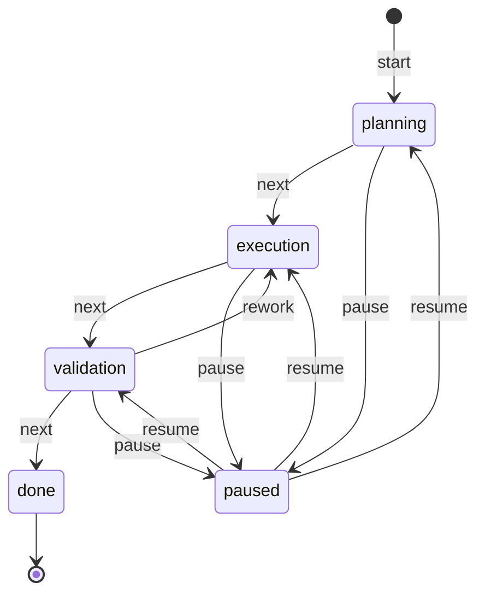

# llm-bot

A provider-agnostic Python client for OpenAI-compatible LLM APIs, extended with
an **agent layer**. Beyond single prompts, it supports multiple LLM providers,
named agents (roles), and persistent multi-turn chat sessions that keep their
own message history.

Architecture layers:

- [`LLMClient`](llm_bot/client.py) — transport: HTTP, retries, auth, payload.
- [`Agent`](llm_bot/agent.py) — a role: system prompt, temperature, max tokens,
  and a reference to a model profile.
- [`Session`](llm_bot/agent.py) — a conversation with an agent; owns its message
  history and persists it to disk.
- Storage backends ([`stores.py`](llm_bot/stores.py)) — pluggable repositories
  for models, agents and sessions (YAML/JSON today, a database later).

This design keeps the console UI ([`cli.py`](llm_bot/cli.py)) thin and makes it
trivial to add a **web interface** later without touching the logic.

## Features

- Provider-agnostic — works with OpenAI, Ollama, LM Studio, LocalAI, GigaChat,
  and any other server exposing the `/v1/chat/completions` endpoint.
- **Multiple providers** — model credentials live in `data/models.yaml`, so you
  can define any number of LLM profiles.
- **Named agents** — roles defined in `data/agents.yaml` (system prompt,
  temperature, max tokens) that reference a model profile.
- **Personalization profiles** — orchestration config in `data/profiles.yaml`
  (style, format, expertise, constraints) composed onto an agent at session
  creation (`--profile developer`); memory is never touched by profiles
  (see "Profiles (personalization)" below).
- **Persistent chat sessions** — each conversation keeps its own history in
  `data/sessions/*.json` and survives process restarts.
- Automatic retries with exponential backoff for transient failures
  (timeouts, network errors, HTTP 429 / 5xx).
- Clear error handling via custom exception types.
- Console entry point: interactive chat (`--agent`) or a single prompt.
- `--details` flag to print request/response diagnostics (URL, model, formed
  request body, token usage, per-attempt timing) to stderr.
- Built-in GigaChat support with automatic OAuth2 token acquisition and refresh.
- **Context compression** — rolling-summary keeps long dialogs inside the token
  budget: recent turns stay verbatim, older ones fold into a running summary that
  is injected at the front of each request (see "Context compression" below).
- **Pluggable context strategies** — three alternative ways to manage context
  *without* summary, all selectable per-agent or per-session (`--strategy`):
  sliding window / sticky facts (key-value durable memory) / branching
  (see "Context strategies" below).
- **Invariants (hard constraints)** — owner-declared architecture/decision/stack/
  business rules stored separately from the dialog (`data/invariants.yaml` +
  per-session entries); injected into every request and enforced by a
  deterministic regex gate BEFORE anything is sent, with self-explaining
  refusals (see "Invariants" below).
- **Task state machine** — the work on a task is formalized as a finite-state
  machine (stage `planning → execution → validation → done` + `paused`, current
  step, expected action). The stage is recognized from the dialog by a small
  LLM call or driven manually via `/task` commands; the snapshot is persisted
  with the session and injected into the system context on every turn, so
  after a pause or a process restart a bare «продолжай» is enough
  (see "Task state machine" below).
- **Comparison scripts** — reproducible experiments (`scripts/compare_compression.py`,
  `scripts/compare_context_strategies.py`) comparing answer quality and token spend
  across strategies.
- Pytest suite using `httpx.MockTransport` (no network needed).

## Project structure

```
llm-bot/
├── llm_bot/
│   ├── __init__.py            # package exports
│   ├── config.py              # LLMConfig — settings from env vars
│   ├── diagnostics.py         # RequestDetails/ResponseDetails + listener protocol
│   ├── client.py              # LLMClient — transport + retries + errors + detail events
│   ├── compress.py            # ContextCompressor + CompressionSettings (rolling summary)
│   ├── context_strategies.py  # SlidingWindow / StickyFacts / Branching (pluggable strategies)
│   ├── task_state.py          # TaskStateMachine: formal task stage/step/action FSM
│   ├── invariants.py          # Invariant/InvariantRegistry: hard constraints + gate
│   ├── profiles.py            # apply_profile: compose ProfileConfig onto AgentConfig
│   ├── stores.py              # Repository interfaces (ModelStore/AgentStore/ProfileStore/SessionStore)
│   ├── yaml_stores.py         # YamlModelStore / YamlAgentStore / YamlProfileStore (data/*.yaml)
│   ├── json_session_store.py  # JsonSessionStore (data/sessions/*.json)
│   ├── agent.py               # Agent (role) + Session (conversation with history)
│   ├── factory.py             # Wiring: assemble client/agent/session from stores
│   ├── gigachat.py            # GigaChat OAuth2 token provider + factory
│   ├── cli.py                 # console entry point (interactive chat / single prompt)
│   └── __main__.py            # enables `python -m llm_bot`
├── scripts/
│   ├── compare_compression.py       # token/quality experiment: with vs without compression
│   ├── compare_context_strategies.py# strategies on a shared "ТЗ" scenario
│   ├── index_documents.py           # local document index: chunking + embeddings + benchmark
│   └── ...                          # other comparison/demo scripts
├── tests/
│   ├── test_client.py         # LLMClient tests (mocked transport)
│   ├── test_agent.py          # Agent + Session tests
│   ├── test_compress.py       # context-compression tests
│   ├── test_task_state.py     # task state machine tests
│   ├── test_compare_compression.py
│   ├── test_index_documents.py # document index (offline, fake embedder)
│   ├── test_rerank.py          # second retrieval stage (offline, fake encoder)
│   ├── test_stores.py         # YAML/JSON store tests
│   └── test_gigachat.py       # GigaChat token provider tests
├── results/                   # experiment reports (markdown)
├── models.example.yaml        # template -> copy to data/models.yaml
├── agents.example.yaml        # template -> copy to data/agents.yaml
├── invariants.example.yaml    # template -> copy to data/invariants.yaml
├── index_queries.example.yaml # template -> hand-written benchmark queries for the index
├── rag_questions.example.yaml       # control questions for the repo + coffee-shop corpora
├── rag_questions.yaml                # control questions for the knowledge-base corpus
├── requirements.txt
├── .env.example
└── README.md

data/                          # runtime data — DO NOT COMMIT (see .gitignore)
├── models.yaml                # real provider credentials
├── agents.yaml                # real agent definitions
└── sessions/                  # per-session chat histories (*.json)
```

## Installation

Requires Python 3.10+.

```bash
cd llm-bot
python -m venv .venv
# Windows:
.venv\Scripts\activate
# macOS/Linux:
source .venv/bin/activate

pip install -r requirements.txt
```

## Configuration

Copy `.env.example` to `.env` and edit it:

```bash
cp .env.example .env   # Windows: copy .env.example .env
```

| Variable             | Default                 | Description                                              |
| -------------------- | ----------------------- | -------------------------------------------------------- |
| `LLM_BASE_URL`       | `https://api.openai.com/v1` | Base URL of the chat-completions API                |
| `LLM_API_KEY`        | *(empty)*               | API key (leave empty for local providers)                |
| `LLM_MODEL`          | `gpt-4o-mini`           | Model identifier                                         |
| `LLM_MAX_RETRIES`    | `3`                     | Retries for transient failures                           |
| `LLM_RETRY_BACKOFF`  | `1.0`                   | Base backoff seconds (exponential: `backoff * 2^n`)      |
| `LLM_TIMEOUT`        | `30`                    | Request timeout in seconds                               |
| `LLM_SYSTEM_PROMPT`  | *(empty)*           | Optional system prompt sent before the user prompt (e.g. to request a JSON response format) |
| `LLM_DEFAULT_SYSTEM_PROMPT` | *(empty)*   | Optional **base** system prompt that is always prepended to any other system prompt (`LLM_SYSTEM_PROMPT`, expert roles, etc.). Set it to keep replies in the user's language by default. Leave empty to disable. |
| `LLM_MAX_RESPONSE_WORDS` | *(empty)*           | Target maximum reply length in words; adds a briefness instruction to the system prompt (empty = no limit). Per-invocation via `--max-response-words`. |
| `LLM_MAX_TOKENS`         | *(empty)*           | Hard cap on generated tokens per reply, enforced by the API (`max_tokens` in the payload). Empty = provider default. |

### Example: use a local Ollama server

```bash
# .env
LLM_BASE_URL=http://localhost:11434/v1
LLM_API_KEY=
LLM_MODEL=llama3.2
```

### Example: GigaChat (Sber)

GigaChat exposes an OpenAI-compatible endpoint, but requires an OAuth2 token
exchange before each session. The client handles this automatically via
`--provider gigachat`: it exchanges your credentials for an access token, caches
it, and refreshes it when it expires (~30 min).

```bash
# .env
LLM_BASE_URL=https://gigachat.devices.sberbank.ru/api/v1
LLM_MODEL=GigaChat-2-Max
GIGACHAT_CLIENT_ID=your-client-id
GIGACHAT_CLIENT_SECRET=your-client-secret
GIGACHAT_SCOPE=GIGACHAT_API_PERS
```

Then run with:

```bash
python -m llm_bot --provider gigachat "Привет! Расскажи о себе"
```

> **Note:** if your Sber credentials only provide a `client_secret` (no separate
> client id), set `GIGACHAT_CLIENT_SECRET` and leave `GIGACHAT_CLIENT_ID` empty,
> or provide a pre-encoded `GIGACHAT_BASIC_AUTH="Basic ..."` if your variant
> differs from `base64(client_id:client_secret)`.

## Models, agents and sessions

The agent layer uses three separate definitions:

1. **Models** (`data/models.yaml`, key `models`) — provider credentials only
   (`base_url`, `api_key`, `model`, optional GigaChat OAuth fields). No behaviour.
2. **Agents** (`data/agents.yaml`, key `agents`) — a role: which model to use,
   the system prompt, temperature and `max_tokens`. Many agents can share one
   model profile while differing in behaviour.
3. **Sessions** (`data/sessions/*.json`) — a conversation with an agent, owning
   its own message history. Sessions are created at runtime, not defined in YAML.

Create the real files from the templates (they are **not** committed):

```bash
mkdir -p data/sessions
cp models.example.yaml data/models.yaml
cp agents.example.yaml data/agents.yaml
cp .env.example .env
```

Secrets in `data/models.yaml` are referenced as `${ENV_VAR}` and resolved from
the environment / `.env`, so real keys never need to be committed. Keep `data/`
out of version control (it is listed in `.gitignore`).

Example `data/models.yaml`:

```yaml
models:
  openai-gpt4o:
    provider: openai
    base_url: https://api.openai.com/v1
    api_key: ${OPENAI_API_KEY}
    model: gpt-4o-mini
  ollama-local:
    provider: openai
    base_url: http://localhost:11434/v1
    api_key: ""
    model: llama3.2
```

Example `data/agents.yaml` (two agents sharing the same model profile):

```yaml
agents:
  translator:
    model: openai-gpt4o
    system_prompt: "Переводи с русского на английский и обратно."
    temperature: 0.2
    max_tokens: 512
  critic:
    model: openai-gpt4o
    system_prompt: "Давай строгий критический разбор текста."
    temperature: 0.9
```

List available agents:

```bash
python -m llm_bot --list-agents
```

## Profiles (personalization)

Profiles answer "HOW should the agent behave for THIS user/task" — the third
config layer. The separation of concerns is strict:

| Layer | File | Answers |
|---|---|---|
| Transport | `data/models.yaml` | which API and how to call it |
| Role | `data/agents.yaml` | who the agent is (role, defaults) |
| **Profile** | `data/profiles.yaml` | how to answer THIS user (style, format, constraints) |
| Memory | `data/memory/` | what was learned from the dialog (facts, decisions) |

A profile is **orchestration config, not memory**: it is declared in YAML like
agents and models, applied once at session creation by
[`apply_profile`](llm_bot/profiles.py) (system-prompt directives +
`max_response_words`/`temperature` overrides), and never written to or read
from the memory layers.

Memory auto-extraction is deliberately conservative: the classifier may store
only what the **user** asserted, never the assistant's own conclusions and never
the contents of retrieved documents. This matters most when RAG is on. A
grounded answer can still be wrong, and an unverified claim that reaches
`long_term` becomes durable — it outranks the RAG block in the message stack
(memory is injected before it) and survives the session, so one confabulation
would contradict the documents on every later turn, including the next session.

Create the file from the template:

```bash
cp profiles.example.yaml data/profiles.yaml
```

Then personalize a chat (the launch command you already use, plus one flag):

```bash
python -m llm_bot --agent assistant --profile developer   # terse, technical, code-first
python -m llm_bot --agent assistant --profile student     # step-by-step, friendly
python -m llm_bot --agent assistant                       # unchanged, no profile
```

Inspect profiles without chatting:

```bash
python -m llm_bot --list-profiles            # all profiles with settings
python -m llm_bot --show-profile developer   # one profile + its generated prompt block
```

Unknown profile names fail fast with the list of available ones — the same
behaviour as unknown agents.

Verify that different profiles give observably different answers to the SAME
question (writes `results/compare_profiles.md` + `.json`):

```bash
python scripts/compare_profiles.py --profiles developer,student,child
python scripts/compare_profiles.py --include-none   # add a no-profile baseline row
```

Programmatic composition (no CLI needed):

```python
from llm_bot.profiles import apply_profile
from llm_bot.stores import AgentConfig, ProfileConfig
from llm_bot.yaml_stores import YamlProfileStore

agent = AgentConfig(name="assistant", model="gpt4o",
                    system_prompt="Ты полезный помощник.")
profile = YamlProfileStore().get("developer")
personalized = apply_profile(agent, profile)
```

## Usage

### Interactive chat with an agent

Start an interactive chat with the `assistant` agent (history is saved to
`data/sessions/` and resumes with the same `--session` id):

```bash
python -m llm_bot --agent assistant
python -m llm_bot --agent assistant --session my-conversation   # resume
```

Inside the interactive chat, type `/history` (or `/история`) to print all
previous messages of the current session; `exit`/`quit`/Ctrl-D leave the chat.

When you resume an existing session (with `--session`), the CLI prints a
`[session]` line to stderr with how much context is loaded: the number of
messages in the history and, depending on the active context strategy, the
sliding-window size (`окно`), the sticky-fact count (`фактов`), or the list of
dialogue branches with the current one marked (`ветки [<current>]: ...`). A
rolling-compression summary is reported as `summary: N симв.`.

A single one-shot turn via an agent:

```bash
python -m llm_bot --agent translator "Good morning"
```

A personalized turn — same agent, different behaviour via a profile
(see "Profiles (personalization)" above):

```bash
python -m llm_bot --agent assistant --profile student "Объясни рекурсию"
python -m llm_bot --agent assistant --profile developer --session dev1   # resumes a session too
```

### Legacy: single direct call

Prompt as an argument:

```bash
python -m llm_bot "Explain what an API is in one sentence."
```

Prompt piped via stdin:

```bash
echo "Summarize this text..." | python -m llm_bot
```

Override settings per-invocation:

```bash
python -m llm_bot --base-url http://localhost:11434/v1 --model llama3.2 "Hello"
python -m llm_bot --model gpt-4o-mini --verbose "Tell me a joke"
```

### Inspecting request/response details

Pass `--details` to see exactly what is sent and how the API responds. Details go
to **stderr**, so the reply on stdout stays clean:

```bash
python -m llm_bot --details "Hello"
```

```
[details] POST https://api.openai.com/v1/chat/completions
[details] model: gpt-4o-mini
[details] request body:
           {
             "model": "gpt-4o-mini",
             "messages": [
               {"role": "user", "content": "Hello"}
             ]
           }
[details] attempt 1: HTTP 200 in 320ms
[details] usage: prompt_tokens=8 completion_tokens=5 total_tokens=13
```

- The printed URL is where the request goes; the model and the fully formed
  request body are shown verbatim (the `Authorization` header is never printed,
  so API keys stay safe).
- On retries, each attempt is reported (`attempt 1`, `attempt 2`, ...) with its
  HTTP status and round-trip time.
- Token usage appears only when the provider reports it (OpenAI does; some local
  servers omit it).

### Enforcing a specific JSON response format

Use a system prompt to tell the model exactly how to format its reply. It can be
set per-invocation with `--system-prompt` or globally via `LLM_SYSTEM_PROMPT`:

```bash
python -m llm_bot \
  --system-prompt 'Отвечай строго в формате JSON со схемой {"answer": string, "summary": string}' \
  "Summarize the provided text"
```

When no system prompt is set, no `system` message is included in the request.

Exit codes:

- `0` — success
- `1` — the LLM call failed (after retries)
- `2` — invalid usage (no prompt provided)

## Tests

Run the mocked test suite (no live API required):

```bash
python -m pytest tests/ -v
```

Coverage includes: successful request, retry-then-success, rate limiting,
network errors, exhausted retries, permanent HTTP errors, unexpected response
shapes, config overrides, and the detail-listener events (request url/model/payload,
token usage, per-attempt reporting).

## Programmatic use

### Via an agent session

Assemble an agent from the stores and chat with it. The session keeps its own
history (persisted to `data/sessions/`), so multi-turn context is automatic:

```python
from llm_bot.factory import make_session
from llm_bot.json_session_store import JsonSessionStore
from llm_bot.yaml_stores import YamlAgentStore, YamlModelStore

session = make_session(
    "my-session",                     # session id (resume with the same id)
    "translator",                     # agent name from data/agents.yaml
    model_store=YamlModelStore(),
    agent_store=YamlAgentStore(),
    session_store=JsonSessionStore(),
)

reply = session.chat("Good morning")  # returns only the text
print(reply)
print(session.history)                # [user, assistant, ...] full transcript
```

An `Agent` is a stateless role; many sessions can share it. History lives on the
session, so different topics or users get independent conversations.

### Direct low-level call (`LLMClient`)

For a single prompt without any agent/session state:

```python
from llm_bot.client import LLMClient, LLMError
from llm_bot.config import LLMConfig

config = LLMConfig.from_env()          # reads .env / environment
client = LLMClient(config)

try:
    answer = client.send_prompt("Hello!")
    print(answer)
except LLMError as exc:
    print("Failed:", exc)
```

To send a pre-built message stack (e.g. a conversation history assembled by the
caller), use [`LLMClient.chat(messages)`](llm_bot/client.py) instead of
`send_prompt`.

For GigaChat, use the factory which wires up the OAuth2 token provider for you:

```python
from llm_bot.config import LLMConfig
from llm_bot.gigachat import build_gigachat_client

config = LLMConfig.from_env()
client = build_gigachat_client(config)  # auto obtains + refreshes the token
print(client.send_prompt("Привет!"))
```

To capture request/response details programmatically, pass a `detail_listener`
that implements the `DetailListener` protocol (URL, model, payload on
`on_request`; status, token usage, timing, attempt on `on_response`):

```python
from llm_bot.client import LLMClient
from llm_bot.config import LLMConfig
from llm_bot.diagnostics import RequestDetails, ResponseDetails

class Printer:
    def on_request(self, d: RequestDetails) -> None:
        print(d.method, d.url, d.model, d.payload)
    def on_response(self, d: ResponseDetails) -> None:
        print(d.status_code, d.usage, d.elapsed_ms, d.attempt)

client = LLMClient(LLMConfig.from_env(), detail_listener=Printer())
print(client.send_prompt("Hello"))
```

## MCP connection

The project includes a minimal **MCP (Model Context Protocol) client** that
connects to a ready-made MCP server and prints its tool catalog
([`scripts/mcp_list_tools.py`](scripts/mcp_list_tools.py), covered by
[`tests/test_mcp_list_tools.py`](tests/test_mcp_list_tools.py); verification
log in [`results/mcp_verification.md`](results/mcp_verification.md)).

```bash
# Local stdio server (default): the mcp-server-time reference server
python scripts/mcp_list_tools.py
# protocol : 2025-11-25
# server   : mcp-time 1.30.0
# tools    : 2
#   - get_current_time   (arg timezone: string, required)
#   - convert_time       (args source_timezone, time, target_timezone)

# Another local stdio server
python scripts/mcp_list_tools.py --command mcp-server-fetch

# Remote server over Streamable HTTP
python scripts/mcp_list_tools.py --url https://mcp.deepwiki.com/mcp
```

How it works: the client spawns the server as a child process and speaks MCP
over stdin/stdout (`stdio_client`), or opens a Streamable HTTP connection
(`streamablehttp_client`); then it performs the `initialize` handshake and
calls `tools/list`. Exit code 0 = connection OK. Dependencies: `mcp`
(official SDK) and `mcp-server-time` — both in [`requirements.txt`](requirements.txt).

Ready-made servers to point the client at:

| Server | How to run / endpoint | Tools |
| --- | --- | --- |
| `mcp-server-time` | `pip install mcp-server-time` (default) | `get_current_time`, `convert_time` |
| `mcp-server-fetch` | `pip install mcp-server-fetch` | `fetch` (URL → markdown) |
| `mcp-server-git` | `pip install mcp-server-git` | `git_status`, `git_log`, `git_diff`, … |
| `mcp-server-memory` | `pip install mcp-server-memory` | knowledge-graph memory tools |
| `@modelcontextprotocol/server-filesystem` | `npx @modelcontextprotocol/server-filesystem <dir>` (Node.js) | sandboxed file read/write |
| DeepWiki | `https://mcp.deepwiki.com/mcp` | repo documentation Q&A |
| Context7 | `https://mcp.context7.com/mcp` | library documentation lookup |

## Own MCP server: notes-CRM + agent tool use

The project ships its **own MCP server** around a small API — a mock-CRM of
notes kept in a JSON file — and an agent integration that calls it
(verification report: [`results/mcp_notes_verification.md`](results/mcp_notes_verification.md)).

- [`llm_bot/api/notes.py`](llm_bot/api/notes.py) — the mock-CRM API
  (`add_note` / `list_notes` / `find_notes`) over `NOTES_DB`
  (default `data/notes.json`).
- [`llm_bot/mcp_servers/notes.py`](llm_bot/mcp_servers/notes.py) — FastMCP
  stdio server registering the three tools with typed parameter schemas and
  text results (run as `python -m llm_bot.mcp_servers.notes`).
- [`llm_bot/mcp_tools.py`](llm_bot/mcp_tools.py) — `MCPToolBridge` (one
  connection per server) and `MCPRouter` (aggregated catalog, `server__tool`
  namespacing, per-server failure isolation).

Agent integration uses a **prompt protocol** (the transport speaks plain
chat-completions): the router injects a system block advertising the tools;
when the model needs one it replies `{"call_tool": {"name": ..., "arguments":
{...}}}` — or a batch `{"call_tool": [{...}, ...]}` when one request needs
several actions. The session executes the call(s) over MCP, feeds the
results back as a service turn and the model produces the final answer
(rounds bounded by `mcp_max_rounds`; a batch costs one round). Each
round-trip is recorded in `session.mcp_events` and printed as `[mcp] ...`
lines on stderr. MCP is opt-in: without `--mcp` the feature is off even when
`data/mcp.yaml` exists, and an explicit `--mcp` with a broken/missing setup
fails with a clean one-line error instead of a traceback.

```bash
cp mcp.example.yaml data/mcp.yaml    # server list (stdio command or HTTP url)

python -m llm_bot --list-mcp                                   # catalog check
python -m llm_bot --agent assistant --mcp notes \
    "запиши заметку: купить корм коту, тег покупки"            # one-shot use
python scripts/mcp_notes_demo.py                               # live 2-turn demo
```

Adding more MCP servers is config-only — new entries in `data/mcp.yaml`
(e.g. `mcp-server-time` or `https://mcp.deepwiki.com/mcp`) selected with
`--mcp notes,time` / `--mcp all`.

## Currency pipeline: the agent composes the tool chain

Rate tools over daily exchange rates (USD/EUR/GBP → RUB, Yahoo Finance,
keyless) where **the agent builds the chain itself** from a single prompt.
There is no step numbering — every tool's first description line states its
data contract (what it consumes, what it returns, where to pass the
result), so different tasks produce different chains: «проанализируй курс
доллара за 2025 год и сохрани отчёт» becomes `fetch_rates` →
`analyze_rates` → `save_report` (one directive per round, the previous
result arriving as a service turn and passed on verbatim), while «получи
курс и выгрузи в файл» becomes just `fetch_rates` → `save_series`
(verification report:
[`results/mcp_currency_yahoo_verification.md`](results/mcp_currency_yahoo_verification.md)).

- [`llm_bot/api/currency_yahoo.py`](llm_bot/api/currency_yahoo.py) — the
  backend: `fetch_rates` (offline `CURRENCY_FIXTURE` mode included),
  `analyze_rates` (period, min/max, mean, change, trend), idempotent
  `save_report` (atomic writes, content-hash dedup) and `save_series` (raw
  dump to a JSON file named by currency+period); the tools accept the
  payload as a JSON string or an already-parsed object.
- [`llm_bot/mcp_servers/currency_yahoo.py`](llm_bot/mcp_servers/currency_yahoo.py) —
  FastMCP stdio server (`python -m llm_bot.mcp_servers.currency_yahoo`);
  each tool's **data contract lives in the first docstring line** — the
  router advertises only that line to the model.
- [`llm_bot/mcp_tools.py`](llm_bot/mcp_tools.py) — `render_tools_block`
  instructs the model to chain calls one at a time and to forward the
  previous tool's result unchanged.

```bash
cp mcp.example.yaml data/mcp.yaml    # adds the "currency_yahoo" server entry
python -m llm_bot --agent assistant --mcp currency_yahoo \
    "проанализируй курс доллара за 2025 год и сохрани отчёт"
python -m llm_bot --agent assistant --mcp currency_yahoo \
    "получи курс евро за 2025 год и выгрузи ряд в файл"   # no analyze_rates
python scripts/mcp_currency_yahoo_demo.py  # live demo: deterministic chain + one-prompt agent run
```

The live LLM leg needs a provider quota that fits two rounds of a
~24-point series (Groq's free 8000 TPM returns 429) and a model that
follows text protocols — models tuned for native tool-calling (e.g. the
`liquid` agent's) reply in Hermes `tool_call` syntax that the plain-chat
protocol cannot parse. The chain mechanics are proven by scripted-LLM
tests in [`tests/test_mcp_currency_yahoo_chain.py`](tests/test_mcp_currency_yahoo_chain.py).

## Scheduler: background tasks 24/7

Delayed and periodic execution as an MCP tool: reminders, periodic data
collection and regular summaries — stored in `data/scheduler.json`, executed
by a long-lived daemon, and **aggregated on demand** via `task_digest`.

Architecture: two independent processes over one shared JSON store —
the stateless MCP server is the "control panel" (task CRUD + results), the
daemon is the "executor" (runs due tasks 24/7). Every store mutation is
guarded by an inter-process `flock`, so the panel and the executor never
interleave.

```bash
# one-time setup: add the "scheduler" server to data/mcp.yaml
cp mcp.example.yaml data/mcp.yaml            # if not done earlier

# start the executor (this IS the 24/7 agent part)
python scripts/scheduler_daemon.py           # tick loop; Ctrl-C stops it
python scripts/scheduler_daemon.py --once    # run all due tasks and exit
                                             # (alternative: external cron)

# chat with the agent that manages the schedule
python -m llm_bot --agent assistant --mcp scheduler
```

What you can ask the agent (it translates to tool calls):

| You say | Agent calls |
|---|---|
| «напомни через 30 минут пересобрать заметки» | `schedule_task(action="reminder", delay_seconds=1800, payload={text: …})` |
| «каждый час собирай курс доллара» | `schedule_task(action="mcp_call", every_seconds=3600, payload={server: …, tool: …})` |
| «что накопилось по финансам?» | `task_digest(group="финансы")` — run counters, fresh results, next fire times |
| «присылай сводку по финансам каждое утро в 9» | `schedule_task(action="llm_summary", daily_at="09:00", payload={sources: "финансы"})` |
| «каждую минуту выдавай сводку по заметкам» | связка: `mcp_call(list_notes, every_seconds=60)` + `llm_summary(sources=…)` — сбор часто, LLM-сводка реже |

Three actions cover everything (any other action name is rejected at
creation — the model gets an immediate error listing the valid names);
new data sources are config, not code:

* `mcp_call` — call any tool of any server from `data/mcp.yaml`
  (`payload: {server, tool, arguments}`); periodic currency/episodes checks
  are just new MCP servers + a scheduled call;
* `reminder` — fires into the results journal (read it back with
  `task_digest`; nothing is pushed into a chat window);
* `llm_summary` — aggregates recent results of source tasks (all / a group /
  explicit ids) into one summary; without a configured model it degrades to a
  deterministic summary, so the daemon works fully offline. When an LLM is
  used, the daemon takes the model named by `SCHEDULER_SUMMARY_MODEL` (see
  `.env.example`), or — if unset — the **alphabetically first** model in
  `data/models.yaml` (`YamlModelStore.list()` returns sorted names, not the
  file order). That model's credentials must be available in the daemon's
  environment (`.env` is loaded from the daemon's working directory).

Schedules: `once` (delay), `interval` (every N seconds), `daily` (at HH:MM
local). Missed runs during downtime are not replayed retroactively: the first
tick after resumption runs the task once and shifts it forward.

Failure handling: every run's outcome is journaled (`ok` flag in
`get_task_results`), and a failing run never yields a fake `done`. A `once`
task retries automatically — up to 3 *consecutive* failures, 30 s apart —
then becomes terminal `failed` (visible in `list_tasks` / `task_digest`).
`interval`/`daily` tasks simply wait for their next scheduled slot after a
failure. The attempt counter tracks consecutive failures (any success resets
it to 0) and appears in the daemon log only for once-tasks; periodic tasks
run without an attempt budget. `resume_task` revives a `failed` task with a
reset counter. Daemon log lines cut long results at ~200 chars with «…» —
the full text is in the results journal.

Tests: `tests/test_scheduler.py` (core math + store, including the
failed-once-must-retry regression) and `tests/test_scheduler_mcp_server.py`
(real stdio processes, including a schedule → daemon `--once` → digest
round-trip).

## MCP orchestration: one prompt, several servers

With several servers registered in `data/mcp.yaml`, the router advertises
them all in one tools block (`server__tool` namespacing) and the agent
composes **cross-server chains** by itself: analysis tools from
`currency_yahoo`, note-taking from `notes`, background scheduling from
`scheduler`. Each round-trip is recorded in `session.mcp_events` with its
own `server` attribution, so selection, routing and call order are all
observable.

```bash
python -m llm_bot --agent assistant --mcp all \
    "проанализируй курс доллара за 2025 год, сохрани отчёт, добавь заметку \
     с итогом и поставь ежедневный сбор курса на 09:00"
python scripts/mcp_orchestration_demo.py   # live: deterministic cross-server chain + agent stage
```

Long flows need more tool rounds than the default budget allows. The budget
lives in the MCP config as a top-level key next to `servers:`:

```yaml
# mcp.yaml — max model replies per turn in the tool loop
# (each round = one model reply; a batch of calls costs one round).
# Default: 4 — enough for a 3-call chain plus the final answer.
max_rounds: 8
servers:
  notes:          ...
  scheduler:      ...
  currency_yahoo: ...
```

Two more pieces make multi-server setups self-contained (tests, demos, the
daemon):

* the config location can be overridden with the `MCP_CONFIG` environment
  variable — the scheduler server validates `mcp_call` targets against the
  same file the session uses, without a hardcoded `data/mcp.yaml`;
* the round budget flows config → `MCPRouter.max_rounds` → the session's
  tool loop; when the budget runs out mid-chain the loop stops cleanly (the
  pending directive is left unexecuted).

Tests: `tests/test_mcp_orchestration.py` — a scripted-LLM long flow over
three REAL stdio servers (`fetch_rates → analyze_rates → save_report →
notes__add_note → scheduler__schedule_task`: strict order, per-server
routing, cross-server data passing, side effects in all three stores), a
batch directive mixing two servers in one round, the round-budget boundary,
and the config→router wiring.

## Token accounting and context limits

The agent counts tokens on every turn and can refuse to send a request that would
overflow the model's context window. For each user message it tracks:

* **request** — tokens for the current user message alone;
* **history** — tokens for the whole prior dialog (system prompt + all past turns);
* **context** — the full stack actually sent to the model (history + request);
* **reply** — tokens the model spent on its answer.

When the provider reports token `usage` (OpenAI does; some local servers do not)
the authoritative numbers replace the local estimates; otherwise a deterministic
`chars/4` estimate plus a per-message overhead is used, so counting always works
offline and for any provider.

* `Session.chat_with_details()` returns a `ChatResult` with a `TokenUsage`
  snapshot; `Session.last_usage` holds the most recent turn's numbers.
* The interactive CLI and one-shot agent calls print `[tokens ...]` to stderr
  after each reply.
* If the assembled context exceeds the model's `context_window`, a
  `ContextOverflowError` is raised **before** anything is sent — the caller must
  trim history or start a new session.
* Some providers impose a **hard per-request token ceiling** from the account
  tier (e.g. Groq's `on_demand` tier refuses any single request above its TPM
  cap even with a full rate-limit bucket — retrying can never help). Set
  `max_request_tokens:` per model (or `LLM_MAX_REQUEST_TOKENS` globally) and the
  agent blocks such requests up front with a `ContextTooLargeError`. A provider
  HTTP 413 whose body reports `Requested > Limit` is also mapped to this error.

Two independent budgets apply — the effective ceiling is the smaller of the
model's `context_window` and the account `max_request_tokens`:

* model window → `context_window` (`ContextOverflowError`);
* account per-request size cap → `max_request_tokens` (`ContextTooLargeError`).

Set both per model in `data/models.yaml` (`context_window:`,
`max_request_tokens:`) or globally via `LLM_CONTEXT_WINDOW` /
`LLM_MAX_REQUEST_TOKENS` (see `.env.example`).

```bash
# Interactive chat; token stats appear on stderr after each reply
.venv/bin/python -m llm_bot --agent assistant

# Offline demo: short vs long vs account-limit vs overflowing dialogs, token
# growth and the failures, using a fake transport (no API key needed)
.venv/bin/python scripts/token_demo.py
.venv/bin/python scripts/token_demo.py --context-window 400 --max-request-tokens 200
```

### Context strategies (without summary)

Besides rolling-summary compression, you can manage context with one of three
**pluggable strategies** that never build an LLM summary. They share a single
code path (`Session` + `Agent.build_messages`) and are selected per-agent (in
`data/agents.yaml`) or per-session via `--strategy`:

| Key        | Strategy                | What is sent to the model                     | Loss? |
|------------|-------------------------|-----------------------------------------------|-------|
| `sliding`  | Sliding Window          | Only the last `context_window_messages` msgs  | early details drop out of the reply |
| `facts`    | Sticky Facts / KV memory| A durable `facts` block + last N messages     | none (memory keeps details) |
| `branching`| Branching               | Full history of the active branch             | none (per branch) |

All three keep the **full** history on disk (in `data/sessions/*.json`); they only
trim what reaches the model. Nothing is deleted from persistent storage.

**Sliding window** — cheap and predictable; pick a `context_window_messages` that
fits the task:
```bash
python -m llm_bot --agent assistant --strategy sliding --window-messages 8
```

**Sticky facts** — the agent maintains a key/value `facts` block (goal, constraints,
preferences, decisions, agreements), refreshed after every turn by a small LLM call,
and sends `facts` + the last N messages. Details survive a small window at the cost
of extra tokens for the refresh:
```bash
python -m llm_bot --agent assistant --strategy facts --window-messages 8
```

**Branching** — fork the dialog into independent lines. `/branch <name>` snapshots
the current position as an automatic checkpoint and starts a new branch; `/switch`
moves between branches; `/branches` lists them:
```
> /branch web          # создаст ветку 'web' от текущей точки (checkpoint автоматически)
> В ТЗ добавить веб-интерфейс
> /switch main         # вернуться к основной линии
```
Each branch keeps its own full history and persists across restarts.

Config example (`data/agents.yaml`):
```yaml
assistant-sliding:
  model: openai-gpt4o
  system_prompt: "Ты полезный помощник."
  context_strategy: sliding
  context_window_messages: 8
```

A reproducible comparison on a shared "ТЗ" scenario is available:
```bash
python scripts/compare_context_strategies.py
```
and its analysis is in [`results/context_strategies_analysis.md`](results/context_strategies_analysis.md).

### Task state machine

The work on a task is formalized as a **finite-state machine**
([`task_state.py`](llm_bot/task_state.py)) with three axes:

* **stage** — the pipeline `planning → execution → validation → done`
  enforced by a transition table (`done` is terminal; there are **no**
  `planning → done` / `execution → done` edges, so a final without validation
  is impossible even for the model);
* **step** — what is being done right now;
* **expected_action** — what should happen next.

`paused` is a first-class state reachable from *any* non-terminal stage; it
remembers the originating stage, so resume returns the machine exactly where
it was.



Two ways to drive the machine:

* **auto-detect** (default) — after every turn a small LLM call recognizes a
  task being set from the dialog, stage hints, and pause/resume phrases
  (same technique as memory auto-extraction). A legal hint moves the machine
  *exactly* to the hinted stage (`move_to`); a classifier failure never
  breaks the turn.
* **manual** — slash-commands take priority over auto-detection:

```text
/task                      — status: stage, pause, step, expected action
/task start <описание>     — start a task (stage = planning)
/task step <текст>         — set the current step
/task action <текст>       — set the expected action
/task next [заметка]       — advance to the next pipeline stage
/task rework [причина]     — validation → execution (fix defects)
/task pause                — pause from any stage
/task resume               — continue (no re-explanation needed)
/task reset                — drop the task state
```

Enable with `--task-state` (CLI override) or `task_state: true` in
`data/agents.yaml`; `--no-task-detect` disables the automatic LLM call.

The snapshot (stage / step / expected action / log) is persisted with the
session (`task_state` key in `data/sessions/<id>.json`) and **injected as a
system message into every request**. This is what makes the two key
requirements work:

* **pause at any stage** — `/task pause` from planning, execution or
  validation (not from `done`; pausing an already-paused task is rejected,
  so no duplicate log entries);
* **continue without re-explaining** — after a pause *or a process restart*,
  a fresh session restores the snapshot from the store and the model sees the
  full task state, so a bare «продолжай» is enough.

Pause is enforced on **two levels**:

1. **Prompt directive** — while paused, the injected block carries a strict,
   non-contradictory instruction («работа ПРИОСТАНОВЛЕНА — не выполняй шаги
   задачи и не предлагай следующие»); the «Продолжай работу…» line is only
   present when the task is active.
2. **CLI hard gate** — in the interactive loop a paused task blocks ordinary
   chat input entirely: messages are not sent to the model until an explicit
   `/task resume` (control commands and `/task ...` still work). While
   stopped, the auto-detection LLM call is skipped too, saving tokens.

**Only the user moves the machine.** The auto-detector advances a stage only
on an explicit user decision in the dialog: an approved *shown* work plan or
collected requirements (planning), a requested review of a *finished*
artefact (execution), or an explicit acceptance of the validation report
(«принято, завершай»). The model's own reports («проверка пройдена,
дефектов нет») are never treated as hints — the agent cannot promote itself
through the pipeline. Machine-generated turns (the CLI auto-turn after a
stage change) are marked `service_turn=True` and skip the detector entirely,
so a stage change can never cascade to `done` without the user. If
`/task next` is issued manually from a stage that produced nothing, the CLI
warns (`[task] внимание: этап 'execution' не имел результатов`) without
blocking — a manual command is a deliberate decision.

**Hint semantics: the stage of the requested work.** The detector maps a
request to the stage whose *work is being requested*, not the user's literal
word: «дай итоговый/финальный результат» asked from planning means
*execution* (produce the artefact), not `done` — `done` is reserved for
explicitly ending the whole task («завершить/закрой задачу»).

**Illegal transitions are impossible — and visibly rejected.** The transition
table is deterministic: neither the model nor the classifier can skip a stage.
When the auto-detector hears a request to jump («пропусти проверку, завершай»),
the machine answers threefold: the attempt is written into the machine's log
(`reject_transition` — persisted, restored after a restart, rendered into the
prompt block so the model knows a jump was denied), reported to the user on
stderr with the legal route (`[task] попытка перейти в 'done' отклонена… путь:
/task next → validation → done`), and kept in `TaskDetectionEvent.rejected_hint`
for diagnostics. A premature forward move (no stage-exit artefact in the
dialog) is marked in the log as «по допущениям». Starting a new task while one
is active is also guarded: `/task start` tells you to `/task reset` first
instead of silently clobbering the running lifecycle.

**Stage-exit criteria in the detector** — the prompt of the classifier
([`_DETECTION_PROMPT`](llm_bot/task_state.py)) distinguishes three cases:

| User says (current stage planning) | Machine behaviour |
|---|---|
| «дай план работы», требования обсуждаются | stay in planning |
| plan shown + «план устраивает, дай итоговый план» | legal `stage_hint: execution` — one step forward |
| requirements answered + user awaits the result | legal `stage_hint: execution` — collected requirements are a planning exit |
| «давай сразу итоговый план», no plan, no requirements | stay; step «сбор требований» |
| «дай финальный этап» (literal «финальный») | `stage_hint: execution` — hint = requested work, not `done` |
| «пропусти проверку / сразу финал» | honest hint → **rejected** (no edge) |

**Stages change what the model actually does** — each stage injects its own
behaviour directive ([`_STAGE_DIRECTIVES`](llm_bot/task_state.py)):
`planning` → "план работы, не итоговый артефакт; когда требования собраны —
резюмируй их и предложи /task next, не выдавая результат в этой же реплике;
если просят результат без собранных требований — доуточни или предложи
/task next по допущениям"; `execution` → "реализуй текущий шаг, результат —
артефакт"; `validation` → "проверяй по критериям; дефекты — предлагай
/task rework"; `done` → "только итоговая сводка". Advancing a stage also
auto-fills `expected_action` with a stage-typical default (a user-set action
is kept), so after `/task next` the model immediately knows what is expected
next.

**Rework loop** — validation may find defects: `/task rework` (or a «переделай»
phrase recognized by the detector) legally moves `validation → execution`
without touching the done edge. `/task next` from validation still means
"проверка пройдена, завершаем" — the two edges are distinct.

**Auto-turn on stage change** — `/task start`, `/task next`, `/task rework`
and `/task resume` immediately send the model one service turn («этап задачи
изменился на … — действуй по состоянию задачи», see
[`_task_auto_turn`](llm_bot/cli.py)), so the stage directive takes effect
*right away* instead of waiting for the user's next message. The same holds
for **auto-detected** stage changes: when a reply moves the machine (G8,
[`_auto_turn_after_detection`](llm_bot/cli.py)), the model acts on the new
stage at once — «дай финальный этап» produces the requirement summary *and*
the artefact in one go, instead of lagging one user turn behind. The reply is
printed in the chat; an `LLMError` is reported to stderr without aborting the
command. `/task pause` deliberately sends **no** auto-turn (the model is never
prompted while paused).

Diagnostics: `session.task_state`, `session.task_events`,
`session.total_task_tokens` (token spend of the detection calls).

Verification on a real model: `python scripts/verify_task_state.py`
(report: [`results/task_state_verification.md`](results/task_state_verification.md)).

### Invariants (hard constraints)

Invariants are **hard constraints the assistant must never violate** — the
chosen architecture, accepted technical decisions, stack limits, business
rules. They follow the project doctrine: explicit *owner configuration*, NOT
memory — nothing from the dialog ever becomes an invariant automatically, and
the dialog can never remove a global invariant.

Create the file from the template:

```bash
cp invariants.example.yaml data/invariants.yaml
```

Storage is separate from the dialog by construction:

* **global** invariants live in `data/invariants.yaml` (`kind_labels` is an
  optional `kind → label` section; the code knows no fixed category taxonomy —
  add new kinds without code changes);
* **session-scoped** invariants (added via `/invariant add`) are persisted
  under the `invariants` key of `data/sessions/<id>.json` — never in the
  message history.

Enforcement is three-level, mirroring the task-pause design:

1. **Prompt directive (always)** — the rendered block (id, kind, statement,
   rationale + a **strengthened refusal protocol** in ALL CAPS with an
   explicit pre-check step: check → refuse → name invariant → explain
   rationale → offer alternative; no workarounds) is injected as the FIRST
   prefix system message on every request (ahead of memory and task state),
   so the model explicitly reasons within the constraints. Additionally, a
   **recency-bias footer** (`render_footer()`) — a short reminder
   "НАПОМИНАНИЕ: check invariants before answering" — is injected as a
   system message immediately before the current user message, so the model
   sees the constraint at the point of maximum attention.
2. **Code gate (pre-flight)** — `forbidden_patterns` (case-insensitive regex
   per invariant) are matched against the user message BEFORE the request is
   sent. A match raises `InvariantViolationError` with a ready refusal naming
   the invariant, its rationale and how to proceed: the request never reaches
   the model, no tokens are spent, and the history is untouched. A conflicting
   one-shot request exits with code **3**.
3. **Reply audit (post-flight, always on)** — one small LLM call after each
   reply checks compliance (detection only, the reply is never rewritten).
   The audit receives the **full turn context** (user message + assistant
   reply) so it can recognize whether the user's request was provocative.
   By default this is a **hard gate**: a violating reply is refused
   (`InvariantViolationError` raised), the assistant reply and user message
   are rolled back from history, and the persisted state is updated. Use
   `--audit-invariants-warn` to downgrade to a warning-only mode (the reply
   is shown but the violation is logged to stderr). The audit is skipped
   entirely when the registry is empty (no invariants wired).

```bash
python -m llm_bot --agent assistant                       # auto-loads data/invariants.yaml
python -m llm_bot --list-invariants                       # inspect global invariants
python -m llm_bot --agent assistant --no-invariants       # disable for one run
python -m llm_bot --agent assistant --audit-invariants-warn  # warn-only audit mode
python -m llm_bot --agent assistant \
  --invariants-file path/to/rules.yaml                    # custom location
```

Inside the interactive chat:

```text
/invariants                     — list the registry (global + session)
/invariant add <тип> <текст>    — add a session-scoped invariant (persisted)
/invariant drop <id>            — remove a session-scoped one (global are protected)
```

When a request conflicts with an invariant, the refusal explains itself: it
names the invariant (id and kind), states the rule, gives the rationale and
asks the user to reformulate or propose alternatives within the constraint —
whether the refusal came from the deterministic gate or from the model
following the prompt protocol.

Programmatic use:

```python
from llm_bot import InvariantRegistry

registry = InvariantRegistry(kind_labels={"stack": "ограничение по стеку"})
violated = registry.check_request("давай перепишем на Django")
if violated is not None:
    print(violated.refusal_text("django"))   # deterministic refusal text
print(registry.render_prompt_block())        # system-prompt fragment
print(registry.render_footer())              # recency-bias reminder ("" if empty)
```

### Context compression (rolling summary)

For long conversations, resending the *whole* history every turn costs tokens and
eventually overflows the context window. Enable **compression** on a session to
fold older turns into a short running summary that is injected at the front of each
request instead of the full old dialog:

* **keep-last (N)** — the most recent N messages stay verbatim, so fresh context
  is exact;
* **block size (M)** — when the live history exceeds M messages, the oldest part
  that falls outside the recent window is folded into the summary. The summary is
  updated **incrementally** (existing summary + new block only), so compressing is
  cheap.

The summary is stored separately in the session file and survives restarts.
Compression is **off by default** and can be enabled **per agent** in
`data/agents.yaml`:

```yaml
agents:
  assistant:
    model: openai-gpt4o
    system_prompt: "Ты помощник."
    keep_last_messages: 10            # N — recent messages kept verbatim
    summarize_messages_threshold: 20  # M — fold the oldest part once history exceeds this
    max_summary_tokens: 500           # optional: hard cap on summary size (tokens)
    # max_summary_ratio: 0.25         # optional: cap summary as a share of the context window
```

When both fields are set, every session created for that agent compresses its
history automatically. Agents without them stay uncompressed. You can still
override/force it programmatically via `make_session(..., compression=...)`:

```python
from llm_bot import CompressionSettings
from llm_bot.factory import make_session

session = make_session(
    "s1", "assistant",
    model_store=model_store, agent_store=agent_store, session_store=session_store,
    transport=transport,
    compression=CompressionSettings(keep_last=10, block_size=20),
)
```

Session attributes: `session.summary` (the running summary),
`session.compression_enabled`, and compression statistics:
`session.compression_events` (list of `CompressionEvent`), `session.total_compressions`,
`session.total_messages_folded`, `session.last_compression_event`.

**Limiting the summary size.** A running summary can grow large over a long
conversation. To keep it from crowding out the context window, cap its size with
`max_summary_tokens` (hard cap, applied in code) and/or `max_summary_ratio`
(soft cap as a fraction of the model's context window; default `0.3`). The
effective budget is the smaller of the two, and the summary is **truncated in
code** to guarantee it fits. The budget is also passed to the summarizer as a
soft instruction ("keep it brief") so the model usually stays under the cap
without truncation.

**Service message.** The CLI prints a line to **stderr** whenever history is folded,
with the token impact and history-size change:

```
[compression] свёрнуто 4 сообщений, -22 токенов контекста, история 8->4, summary 2 симв., (всего сжатий: 3)
```

Programmatic callers can pass an `on_compress` callback to `make_session(...)` to be
notified of each fold:

```python
from llm_bot import CompressionEvent

def on_compress(e: CompressionEvent) -> None:
    print(f"folded {e.messages_folded} msgs, saved ~{e.folded_tokens} tokens")

session = make_session(..., on_compress=on_compress)
```

> **Cost/quality tradeoff.** Compression saves prompt tokens (recent real runs:
> ~39% on a 24-fact dialog even after charging the summarization calls), but a
> lossy summarizer can drop some older facts. See
> [`results/compression_analysis.md`](results/compression_analysis.md) and run the
> reproducible experiment:
>
> ```bash
> python scripts/compare_compression.py                   # lossless (retention 1.0)
> python scripts/compare_compression.py --retention 0.6   # lossy summarizer
> ```

## Comparing prompt strategies

[`scripts/compare_methods.py`](scripts/compare_methods.py) runs one task through
**four prompting strategies** and prints a comparison table, so you can see how
much the approach affects the answer:

1. **Прямой ответ** — the raw task, no extra instructions.
2. **Решай пошагово** — the task plus a "solve step by step" instruction.
3. **Сначала промпт → потом решение** — first ask the model to draft a good
   prompt, then solve using that drafted prompt (two calls).
4. **Группа экспертов** — a panel of roles (analyst, engineer, critic); each
   expert solves the task **independently** with its role description sent as the
   system prompt and the task text as the user prompt (one call per role).

The script builds on `LLMClient`, so **provider and model come from your `.env`**
(`LLMConfig`), exactly like the rest of the project. No extra config needed.

```bash
# Run both built-in tasks with all 4 methods
.venv/bin/python scripts/compare_methods.py

# A single built-in task
.venv/bin/python scripts/compare_methods.py --task-index chickens
.venv/bin/python scripts/compare_methods.py --task-index fizzbuzz

# Your own task (+ expected answer to enable automatic scoring)
.venv/bin/python scripts/compare_methods.py \
  --task "What is 7*6+9?" --expected 51

# Use GigaChat (auth comes from GIGACHAT_* env vars)
.venv/bin/python scripts/compare_methods.py --provider gigachat

# Save the report as markdown or JSON
.venv/bin/python scripts/compare_methods.py --out results/comparison.md

# Run only some methods
.venv/bin/python scripts/compare_methods.py --methods direct,experts

# Keep each reply brief (soft word limit, same as the CLI's --max-response-words)
.venv/bin/python scripts/compare_methods.py --max-response-words 50

# Print per-request details (URL, model, payload, token usage) to stderr,
# same as the CLI's --details
.venv/bin/python scripts/compare_methods.py --details
```

The built-in logical tasks have a known **canonical answer**, so the script can
flag which methods got it right. Scoring is **language-agnostic**: when the
expected answer contains numbers, the script checks that the same numbers appear
in the reply (e.g. the English `"Chickens: 16, Cows: 6"` correctly matches the
Russian canonical answer `"6 коров, 16 кур"`). For expected answers without
numbers it falls back to a word-overlap check. The report shows every prompt and
response, a verdict column, and — for the multi-step methods — the intermediate
outputs.

## Comparing models by tier (weak / medium / strong)

[`scripts/compare_models.py`](scripts/compare_models.py) runs the **same request**
through several models on the same OpenAI-compatible endpoint (by default a weak,
a medium and a strong model) and reports, per model:

- **latency** — total wall-clock response time in milliseconds;
- **tokens** — `prompt` / `completion` / `total` from the provider's `usage`;
- **cost** — estimated USD price via a small price table (0 for free/local models);
- **quality** — automatic correctness score against an expected answer when one is
  known (same language-agnostic scoring as `compare_methods`), otherwise manual.

The **base URL / provider** come from your `.env` (`LLMConfig`) exactly like the
rest of the project; the models themselves are passed explicitly, since comparing
tiers means calling *different* models on the same endpoint.

```bash
# Run all built-in tasks through the default weak/medium/strong ladder on Groq
.venv/bin/python scripts/compare_models.py --out results/

# A single built-in task, markdown or JSON report
.venv/bin/python scripts/compare_models.py --task-index chickens --out results/compare_models_chickens.md
.venv/bin/python scripts/compare_models.py --task-index chickens --out results/compare_models_chickens.json

# Your own task (+ expected answer to enable automatic quality scoring)
.venv/bin/python scripts/compare_models.py --task "What is 7*6+9?" --expected 51

# Explicit model set
.venv/bin/python scripts/compare_models.py \
  --models openai/gpt-oss-20b,openai/gpt-oss-120b,qwen/qwen3.8-27b

# Prices for a paid provider (USD per 1M input/output tokens); repeatable
.venv/bin/python scripts/compare_models.py --price "gpt-4o=2.50,10.00"

# Use GigaChat (auth comes from GIGACHAT_* env vars)
.venv/bin/python scripts/compare_models.py --provider gigachat

# Per-request details (URL, payload, token usage) to stderr, like the CLI's --details
.venv/bin/python scripts/compare_models.py --details
```

The default model ladder is tailored to this project's Groq account
(`openai/gpt-oss-20b` → `openai/gpt-oss-120b` → `qwen/qwen3.8-27b`). If a model id
isn't available on your account you'll get a `404` — pass your own ids with
`--models`. An example report is in
[`results/compare_models_analysis.md`](results/compare_models_analysis.md).

## Local document index (chunking + embeddings)

`scripts/index_documents.py` builds a local JSON index over a directory of
documents: it chunks them two ways, embeds the chunks with a local CPU model
(`paraphrase-multilingual-MiniLM-L12-v2`, 384 dims, ~470 MB download, 128-token
window) and reports which chunking strategy retrieves better.

```bash
# index the markdown of this repo (first run downloads the model)
python scripts/index_documents.py --input_dir . --extensions .md

# no network: use only the local HuggingFace cache
python scripts/index_documents.py --input_dir . --extensions .md --local_only

# code as well (.py files are chunked by top-level def/class), custom output
python scripts/index_documents.py --input_dir . --extensions .md,.py \
    --index_dir data/emb --out results/index_documents_report.md

# add hand-written questions to the auto-generated benchmark
python scripts/index_documents.py --input_dir . --extensions .md \
    --eval index_queries.example.yaml
```

### Two chunking strategies

|                    | `fixed_size`                                            | `structure`                                                    |
| ------------------ | ------------------------------------------------------- | -------------------------------------------------------------- |
| Boundaries         | sliding windows of `--chunk_size` tokens, snapped to word edges | Markdown headings, top-level `def`/`class`, PDF pages, paragraph runs |
| Size control       | exact: `--chunk_size` tokens, `--chunk_overlap` reused  | `--structure_max_tokens` budget (default: the model window minus `[CLS]`/`[SEP]`); an oversized section is packed on paragraphs and bisected on line boundaries |
| `section` metadata | empty                                                   | the section path (`"A > B"`), so a hit points at a real section |
| Weakness           | cuts sections in half — a heading query matches a fragment | short sections stay short (`--structure_min_chars`); a one-line section (a Markdown table row) cannot be split at all |

Sizes are counted in **tokens of the embedding model**, not characters: a
1200-character Russian chunk is ~320 MiniLM tokens and everything past 256 is
silently dropped by the model. That is what the report's
`доля чанков длиннее окна модели` row measures, and why the original
"1000 characters per chunk" default was wrong.

### Output

- `index_<strategy>.json` — chunks, L2-normalized embeddings, metadata;
- `comparison.json` — the same numbers for both strategies, machine-readable;
- a markdown report: corpus summary, metadata sample, size/coverage/duplicate
  statistics and the retrieval benchmark.

Metadata per chunk: `chunk_id`, `source`, `title`, `section`, `section_title`,
`document_id`, `chunk_position`, `start_line`, `end_line`, `char_start`,
`char_end`, `char_count`, `token_count`, `content_hash`, `chunking_strategy`.
The `char_*` offsets are exact spans of the source file, so a hit can be
verified by span overlap and a chunk can be re-read straight from disk.

### Asking the index by hand

```bash
# one-off: build the index and ask it in the same run
python scripts/index_documents.py --input_dir . --extensions .md \
    --query "GigaChat OAuth2 token" --top_k 3

# afterwards: ask the stored index, no re-chunking and no re-embedding
python scripts/index_documents.py --reuse --strategy structure --top_k 3 \
    --query "rolling summary сжатие истории" --local_only
```

```
[structure] GigaChat OAuth2 token
  0.626  README.md:162-183  llm-bot > Configuration > Example: GigaChat (Sber)
       ### Example: GigaChat (Sber)
  0.486  plans/details.md:85-89  ... > Changes > 4. `llm_bot/gigachat.py`
       ### 4. `llm_bot/gigachat.py`
```

`--query` is repeatable, `--top_k` sets how many hits are printed, `--strategy`
picks the index to search. `--reuse` takes the model from the index itself (a
`--model` that contradicts it is a hard error — vectors of two models are not
comparable) and refuses to run without `--query`.

The two strategies differ exactly where it matters: for the same question
`fixed_size` returns the neighbouring "Ollama server" fragment, `structure`
returns the whole GigaChat section. Every hit carries `file:line`, so verify it
with `sed -n '162,183p' README.md`.

#### Which model, and why not E5

The default is `paraphrase-multilingual-MiniLM-L12-v2` because it was measured
against `all-MiniLM-L6-v2` on this corpus at an equal chunk budget
(`--chunk_size 120`, both strategies, reproduce with `--model all-MiniLM-L6-v2`).
On the 7 hand-written Russian questions the multilingual model answered 43% at
rank 1 (`structure`), the English-only MiniLM 0% — while the 117
heading-derived queries of the full benchmark reported 72% vs 49% and hid the
gap almost completely. Model choice mattered far more for real questions than
the average suggested, which is the argument for keeping `--eval` questions in
the benchmark.

`intfloat/multilingual-e5-*` retrieves better still, but it is only trained to
work with `query: ` / `passage: ` prefixes. This indexer encodes passages and
questions through one path, so an E5 model here would either be fed the wrong
prefix (silently worse numbers) or need prefix plumbing in every call site. Not
worth it for a local index; keep it in mind if precision becomes the goal.

### Benchmark

Every section heading becomes a query whose gold answer is that section's exact
character span; a retrieved chunk counts as a hit when it overlaps the span.
Reported as `recall@1/3/5` and `MRR@10`. `--eval` adds domain questions on top
(see `index_queries.example.yaml`); an unknown `source` or an ambiguous
`section` is a hard error, so the file cannot silently rot.

```python
import json, math

index = json.load(open("data/emb/index_structure.json", encoding="utf-8"))
query = index["chunks"][0]          # in production: embed a real question
ranked = sorted(
    ((math.fsum(a * b for a, b in zip(row["embedding"], query["embedding"])),
      row["metadata"]) for row in index["chunks"]),
    key=lambda pair: pair[0],   # key обязателен: при равных score сравниваются
    reverse=True,               # dict-ы, и сортировка падает с TypeError
)
for score, meta in ranked[:3]:
    print(f"{score:.3f} {meta['source']}:{meta['start_line']}-{meta['end_line']}"
          f"  {meta['section']}")
```

Vectors are normalized, so a dot product *is* cosine similarity.

Useful flags: `--index_dir` (default `data/emb`, git-ignored), `--out`
(empty string disables the report), `--strategy both|fixed_size|structure`,
`--unit tokens|chars`, `--structure_min_chars`, `--structure_max_chars`
(secondary cap, off by default), `--query`/`--top_k`/`--reuse`, `--model`,
`--batch_size`, `--max_docs`, `--dedup`, `--local_only`. `.pdf` is supported with the optional `pypdf`
dependency; vendored trees (`.venv`, `node_modules`, `data/`, `results/`, …)
are never indexed.

`--pdf_max_pages N` keeps only the first `N` pages of each PDF (`0` = all). It
exists because a one-page service description repeats its terms verbatim on
pages 2–4: in a measured 13-file corpus those pages were 80% of the volume and
0.90–1.00 similar to each other, while page 1 held the only unique facts. Truncating
quietly would make "the fact is not in the corpus" and "the fact was never
indexed" look identical, so the report states how many pages were left out.
Line numbers in a PDF citation (`file.pdf:12-38`) are positions in the text
extracted by pypdf, not in the original file; the chunk metadata carries
`page 1` alongside them.

Tests: `tests/test_index_documents.py` (offline, no model download).

## RAG: ответы по локальному индексу

The index above is a library. `llm_bot/rag.py` makes it answer questions:
`Retriever` searches a prebuilt `index_*.json` with cosine similarity, formats
the best chunks as a `file:line`-traceable context block, and hands it to the
model as an extra per-request prefix.

```bash
# answer from the repo index (build it first, see above)
python -m llm_bot --agent researcher --rag \
    --rag-index data/emb/index_structure.json \
    "Что такое RAG и как он устроен в этом проекте?"
```

`--rag` works with **any** agent — `--agent researcher` above is a ready-made
low-temperature agent from `data/agents.yaml`, not a requirement. The grounding
rule is carried by the block itself, identically for every agent.

| flag | default | meaning |
| ---- | ------- | ------- |
| `--rag` | off | enable retrieval for this run; without it the bot behaves exactly as before |
| `--rag-index` | `data/emb/index_structure.json` | which index to search; the embedding model is taken from the index itself, and a `--model` contradicting it is a hard error |
| `--rag-top-k` | `4` | how many chunks reach the prompt |
| `--rag-rerank` | off | re-score a wider shortlist with a cross-encoder first; extra model load, zero prompt tokens |
| `--rag-rerank-candidates` | `20` | shortlist handed to the reranker; irrelevant without `--rag-rerank` |
| `--rag-rerank-min-score` | unset | optional threshold; see below for why it is off by default |
| `--rag-max-tokens` | unset | hard cap on the context block; unset means "derive it from the context window" |

`--rag-rerank` needs `--rag`; on its own it exits with an error rather than
quietly doing nothing, so "the reranker found nothing" never gets confused with
"the reranker never ran".

### Why the second stage exists

Dense search compares one vector per chunk, so a chunk that is on-topic for a
whole document outranks the chunk that states the fact. On a measured
near-duplicate corpus the right chunk sat at rank 11 for a question about one
service's height and weight limits — present, close, outside `top_k`. Measured
over the 34 answerable questions:

| | retrieval@1 | retrieval@4 | fact coverage | PASS |
| --- | --- | --- | --- | --- |
| dense only | 13/34 | 22/34 | .662 | 25/40 (.625) |
| + cross-encoder | 20/34 | **32/34** | **.971** | **36/40 (.900)** |

Two defaults come from those measurements. The shortlist is **20** wide, because
recall@20 was 34/34 — that is the ceiling for the stage, and going wider would
only add latency. And the passage handed to the cross-encoder is prefixed with
`source — section`, which is worth three questions out of 34 on its own: the
corpus is full of near-duplicate documents, and the filename is what tells
them apart, not the body text.

### Why there is no threshold

There is `--rag-rerank-min-score`, and it is off by default because measuring it
said so. The two score distributions overlap: the lowest-scoring correct chunk
sits at **-4.0**, while an unanswerable question about a product that is
genuinely absent from the corpus peaks at **+0.7** — above ten correct answers,
because the document set really is about that product. Replaying one run's
shortlist at several thresholds, reading the scores back off the saved run:

| threshold | answerable kept | traps still fed | chunks per question |
| --- | --- | --- | --- |
| off | 32/34 | 6/6 | 4.0 |
| -4 | 30/34 | 4/6 | 3.2 |
| -2 | 26/34 | 4/6 | 1.9 |
| 0 | 23/34 | 2/6 | 1.1 |
| +2 | 17/34 | 0/6 | 0.5 |

The filter removes correct answers long before it removes misleading ones. It
is available, it is measured, and it is not the default.

The embedding model (~470 MB) is downloaded on the first `--rag` run and cached
afterwards; `--local_only` belongs to `scripts/index_documents.py`, not here.

The block is placed **after** the MCP/tool context and **before** the strategy
prefix, so tool output stays closest to the question and the retrieval block
reads as part of the same evidence. Its budget is `min(--rag-max-tokens, 25% of
the agent's context window)`. Chunks are added worst-score-first and dropped
again if the next one would overflow the budget; a chunk is only included if at
least one whole word of it fits, so the model never sees a fragment cut mid
sentence.

Grounding is *asked for* by instruction: the block tells the model to answer
**only** from the context, to cite `[file:lines]` after every fact, and to say it
did not find an answer rather than invent one. That rule lives in the
block (`_RAG_PROTOCOL` in `llm_bot/rag.py`) and nowhere else — not in
`data/invariants.yaml`, and not in any agent's `system_prompt`. Two reasons:

- an invariant would be global, so it would force the agent to refuse everything
  in `--no-rag` mode, when there is no context to ground in;
- a copy inside an agent would be a third source of truth. It already drifted
  once, which is why the agent configs no longer restate the rule.

### Two ways to run it: with sources, without

`--rag` asks the model to tag every fact with `[file:lines]` and audits those
tags afterwards. When the sources are noise for the current task, `--rag-no-cite`
answers from the same retrieved context without them:

```
--rag --rag-no-cite
```

| | `--rag` | `--rag --rag-no-cite` |
|---|---|---|
| Retrieval, reranking, token budget | on | on |
| "Answer only from this context" | on | on |
| No-blending rule | on | on |
| "Say you did not find it" | on | on |
| "Tag every fact with `[file:lines]`" | on | **off** |
| Citation audit, `[источник не подтверждён]` marker | on | **off** |

Nothing was deleted: the citation format lives in `_RAG_PROTOCOL`, the version
without it in `_RAG_PROTOCOL_NO_CITATIONS`, and `Retriever(cite=False)` picks
between them. Drop the flag to get sources back.

### Invariant ids are not citations

The prompt renders every invariant as `- [STACK-1] (kind) statement`, and models
often work their checklist into the reply:

```
Проверяю запрос против инвариантов:
- [RULE-LANG]: Вопрос на русском → отвечаю на русском ✓
```

`[STACK-1]` names a rule, not a document. The audit used to count those brackets
as source citations, could not find them in the retrieved block, and replaced
five valid ids with `[источник не подтверждён]` while logging five warnings on an
answer whose facts were all correct. `audit_citations(..., ignore=…)` now takes
the ids from the registry, so they pass through untouched and stay out of both
`kept` and `dropped`. A reply citing nothing but invariants still counts as
uncited, which is what it is.

What code *does* enforce is the citation. `audit_citations` checks every
`[file:lines]` in the reply against the block that was actually sent — file name
and line range — and replaces anything unsupported with
`[источник не подтверждён]`. This is not a formality. On a near-duplicate corpus
**12 of 15** citations to one document came back with a single digit
changed from the name on disk: the model rewrites what it copies, and nothing
noticed. Unsupported citations are marked rather
than deleted, because a wrong source in brackets reads as a verified one. Over a
10-turn dialogue run three times (27/30 correct by content) the audit also caught
12 turns that cited a document the block never contained — the model answering
from its own earlier replies in history rather than from the evidence sent this
turn. `Session.citation_audits` exposes the per-turn result.

Two details of the check are deliberate. A citation may name the document by
its id alone (`[ID-250-439-931-337]`) — the model does that — and that is
accepted **only if that id belongs to exactly one document in play**; if two
share it, the id identifies nothing and the citation stays unsupported. And
a factual turn that cites nothing at all is not silently clean: `uncited` is set,
because "no citation" is the case the protocol exists for and there is nothing to
replace in the text.

Whether a citation from an *earlier* turn of the same dialog counts is a policy
call, not a technical one, and both are implemented: `audit_citations(also_backed=…)`
accepts ranges this dialog already verified, and `make_session(rag_reuse_evidence=True)`
turns it on. Measured over the same 10 turns x 3 runs it is 15/30 strict versus
17/30 with reuse, and it does not touch the real defect — the rewritten number
survives either way. It is off by default because the block is rebuilt per turn
on purpose.

### Two rules for documents that look alike

The corpus is 13 one-page descriptions of unrelated services, and two of them
describe the same offering: they share 15 of their 18 indexed lines and differ
in three — the title, one word of the service line, and one number (20 minutes
against 90). Without help the model answers a question about one from the
other's chunk and cites the first, so two mechanisms were added:

- **No blending** (`_RAG_NO_BLENDING`, part of the block): facts belong to one
  document, take them only from the block with the same file name, and when the
  customer has not said which one they mean, show the difference or ask.
- **Subject continuity** (`Session._rag_subject`): the documents already cited
  in this dialog keep a slot in the block. A follow-up like «а он долго
  действует?» names no product at all, and since every document repeats the
  same wording, the customer's own document fell out of the top-4 entirely and
  the answer came from an unrelated business whose document *does* state a
  flat validity period.

Neither of these is a win on a dialog benchmark. Over the same 10 turns x 3 runs
the scores are 28/30, 27/30, 26/30 and 23/30 for no blending, plus subject
continuity, plus two further prompt rules — all inside the run-to-run noise, and
every added rule made it worse.

A third mechanism was built and then removed: the indexer computes, for each
document, the lines whose **numbers** occur nowhere in its nearest near-duplicate
(«занятие длится 20 минут» against «занятие длится 90 минут»), and the
retriever prints them above the chunk as `ОТЛИЧАЕТСЯ ОТ …`. The selection rule
cannot be wrong — a number is either in the sibling or it is not — and word-level
alternatives were tried first and rejected for exactly that reason (token
similarity rates a marketing slogan «это настоящий экстрим!» at 0.07 and a
factual clause «длительность 20 минут» at 0.10, so it cannot tell a fact from
a slogan). It still measured **worse: 15/30 with the card, 16/30 without**, and
the reason is structural rather than a tuning problem. A card can only be printed
for the chunk that contains its lines, so on a follow-up that resolves a pronoun
— «То есть в моём документе это <другой вариант>?» — where the retrieved chunk
is the marketing one and the card lives in a different chunk —
there is no card at all, which is the one case it was built for. And it prints the
sibling's file name directly above the text, which is precisely what the
no-blending rule tells the model not to do. Turn 3 went 1/3 → 0/3.

What is left failing, over 10 turns x 3 runs:

| turn | correct | why |
| ---- | --- | --- |
| 3 | 1/3 | answers about the other document when asked about *«моём»* |
| 5 | 0/3 | «рекомендуем использовать в течение 6 месяцев» becomes «срок действия — 6 месяцев» |
| 9 | 0/3 | cites the other product's file for «оба в одном городе» |

Turn 5 is a claim-strength failure with the right evidence sitting in the prompt,
and prompt wording has been tried four times without moving it — see
`data/certs_eval/dialogue.yaml` for the measurements and the raw answers.

`researcher` therefore carries only a persona and `temperature: 0.1`. Nothing
about grounding depends on it.

Two properties are deliberate:

- **The block is not persisted.** It is rebuilt per request from the current
  index, so editing a document is visible immediately and the history never
  accumulates stale quotes.
- **Retrieval never breaks the bot.** A missing or corrupt index, a model that
  cannot be loaded, a query the embedder chokes on — all of it is logged to
  stderr and the turn proceeds without context. `--rag` is an enhancement, not
  a new failure mode.

`Session` exposes what actually happened: `rag_events` (all queries) and
`last_rag_event` (the last one) with hits, scores, dropped chunks and the
token accounting. The CLI prints the last event under the answer.

`knowledge_base/` holds a second, deliberately boring corpus (a coffee shop
menu, delivery terms) to check that grounding generalizes outside the repo's own
prose. It is added to the indexer's `DEFAULT_EXCLUDES`, so building the repo
index stays at 12 documents and does not silently mix the two corpora.

A third corpus lives entirely under `data/`, git-ignored: a set of scanned
one-page service descriptions with near-duplicate bodies. Nothing about it is
committed — not the documents, not the control questions. The lessons below
are measured there, and the numbers are quoted without the corpus.

Its reports go to `data/results/`, which the `data/` rule already covers, so
they need no entry of their own in `.gitignore`. `results/` stays tracked and
holds only the repo and coffee-shop reports — point `--out` at `data/results/`
for this corpus.

One tuning note generalises past it. Chunking with `--structure_max_tokens 128`
split two senses of one word — the imperative «сделать это самостоятельно?» (line
4) against the parenthetical «(самостоятельно)» in a venue line (line 11) — into
*different* chunks. Both the cross-encoder and the model then matched the wrong
sense and the bot invented a rule about solo participation that no document
states. At 192 both senses share one chunk and the model answers from the real
sentence. Re-ranked
retrieval went 32/34 → 33/34; the block grew from 396 to 588 tokens.

`scripts/compare_rag.py` gained a third arm, `rag_rerank`, and runs it *next to*
the plain `rag` arm rather than instead of it, so the before/after lives in one
run and one set of questions:

```bash
python scripts/compare_rag.py --questions "$QUESTIONS" \
    --model leanstral --corpus "$CORPUS" --rerank --top-k 4 \
    --out "$OUT"
```

Every case also stores the re-ranked shortlist with its scores
(`RagEvent.scored`), so the threshold sweep is pure arithmetic over a saved run
— `--from_json` rebuilds the whole report, sweep included, without touching the
provider at all.

Tests: `tests/test_rag.py`, `tests/test_rerank.py`, `tests/test_compare_rag.py`
(offline).

## Adding a web interface

Because the request logic is isolated in `LLMClient`, adding a web UI is mostly
just adding a route that calls it. Below is a minimal [FastAPI](https://fastapi.tiangolo.com/)
example to illustrate how easy the integration is:

```python
# web.py (new file)
from fastapi import FastAPI
from pydantic import BaseModel

from llm_bot.client import LLMClient, LLMError
from llm_bot.config import LLMConfig
from llm_bot.diagnostics import RequestDetails, ResponseDetails

app = FastAPI()
client = LLMClient(LLMConfig.from_env())


class PromptRequest(BaseModel):
    prompt: str


class RequestLog:
    """Reuse the same detail events the CLI uses — here we collect them."""

    def __init__(self) -> None:
        self.details: list[dict] = []

    def on_request(self, d: RequestDetails) -> None:
        self.details.append({"request": {"url": d.url, "model": d.model, "payload": d.payload}})

    def on_response(self, d: ResponseDetails) -> None:
        self.details.append({"response": {"status": d.status_code, "usage": d.usage}})


@app.post("/chat")
def chat(req: PromptRequest):
    log = RequestLog()
    client = LLMClient(LLMConfig.from_env(), detail_listener=log)
    try:
        reply = client.send_prompt(req.prompt)
        return {"reply": reply, "details": log.details}
    except LLMError as exc:
        return {"error": str(exc)}
```

Steps to go web-ready:

1. Add `fastapi` and `uvicorn` to `requirements.txt`.
2. Create `web.py` like the example above.
3. Run with `uvicorn web:app --reload`.

You can then call it with:

```bash
curl -X POST http://127.0.0.1:8000/chat \
  -H "Content-Type: application/json" \
  -d '{"prompt":"Hello"}'
```

No changes to `LLMClient` are required — the same instance, configuration, and
error handling are reused by both the console and the web layer. For heavier web
usage you may want to keep a single long-lived `LLMClient` (instead of creating
one per request) and, optionally, add an async variant using `httpx.AsyncClient`.