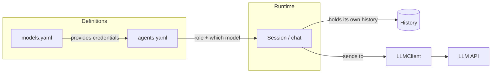
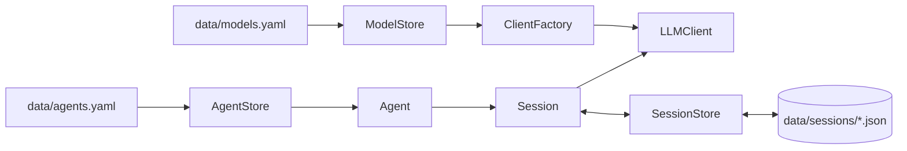

# План: выделение Агента как отдельной сущности + много провайдеров

## Цель

Сделать из текущего «разового вызова LLM» настоящего **агента** — отдельную
сущность, которая инкапсулирует логику запроса/ответа, сама складывает стек
сообщений и передаёт его LLM, а наружу отдаёт только результат.

Дополнительно:
- поддержка **нескольких LLM/провайдеров**;
- **трёхуровневая модель**: профиль (реквизиты) → агент (роль) → сессия (история);
- **легко заменяемые хранилища** (YAML/JSON сейчас, БД позже) через интерфейсы;
- **данные не коммитятся** — рабочие `models.yaml`, `agents.yaml` и сессии лежат
  в каталоге `data/`, который добавлен в ignore.

## Чего не хватает в текущей реализации

Проанализировав [`client.py`](../llm_bot/client.py),
[`cli.py`](../llm_bot/cli.py), [`config.py`](../llm_bot/config.py) и
[`gigachat.py`](../llm_bot/gigachat.py):

1. **Нет сущности «Агент».** [`LLMClient`](llm_bot/client.py:77) — клиент на
   один запрос: [`send_prompt()`](llm_bot/client.py:262) принимает строку,
   строит payload из одного system + одного user и возвращает текст. Это
   «просто один вызов API».

2. **Нет стека сообщений / истории.** Каждый вызов собирает `messages` заново
   в [`_build_payload()`](llm_bot/client.py:156); история нигде не хранится;
   CLI одноразовый.

3. **Настройки генерации неполны и разбросаны.** Есть `temperature`, но нет
   `max_tokens`. Системный промпт собирается внутри клиента
   ([`_build_system_prompt()`](llm_bot/client.py:128)), а не настраивается
   агентом.

4. **Только один провайдер.** Вся конфигурация — из одного набора env
   ([`config.py`](llm_bot/config.py:84)).

5. **История не переживает перезапуск**, и нет разделения «агент vs чат».

## Трёхуровневая модель



### Уровень 1 — Профиль модели (`data/models.yaml`, ключ `models`)

Только **реквизиты провайдера** (транспорт), без поведения:

```yaml
models:
  openai-gpt4o:
    base_url: https://api.openai.com/v1
    api_key: ${OPENAI_API_KEY}
    model: gpt-4o-mini
    provider: openai            # openai | gigachat
  ollama-local:
    base_url: http://localhost:11434/v1
    api_key: ""
    model: llama3.2
    provider: openai
  gigachat-max:
    provider: gigachat
    model: GigaChat-2-Max
    client_id: ${GIGACHAT_CLIENT_ID}
    client_secret: ${GIGACHAT_CLIENT_SECRET}
```

### Уровень 2 — Агент (`data/agents.yaml`, ключ `agents`)

**Поведение/роль + ссылка на профиль.** Не хранит историю. Многие агенты могут
ссылаться на один профиль, отличаясь настройками:

```yaml
agents:
  translator:
    model: openai-gpt4o           # ссылка на профиль из models.yaml
    system_prompt: "Переводи с русского на английский и обратно."
    temperature: 0.2
    max_tokens: 1024
  critic:
    model: openai-gpt4o           # тот же профиль
    system_prompt: "Давай строгий критический разбор текста."
    temperature: 0.9
```

Агент — **неизменяемая роль**; из него создаются сессии.

### Уровень 3 — Сессия / чат (история)

**Отдельная сущность** с собственной историей, привязанная к конкретному
агенту:

- один агент → **много независимых чатов** (разные темы = разные контексты);
- **другой пользователь** → свой чат с тем же агентом;
- история сохраняется на диск (`data/sessions/*.json`, по файлу на сессию)
  и переживает перезапуск CLI.

```python
class Session:
    def __init__(self, agent: Agent, history: list[dict[str, str]] | None = None):
        ...

    def chat(self, user_message: str) -> str:
        # 1) user -> history
        # 2) messages = [system из агента] + history
        # 3) отправить через LLMClient
        # 4) assistant -> history
        # 5) вернуть только текст
        ...

    @property
    def history(self) -> list[dict[str, str]]: ...
```

## Ключевое разделение ответственности

| Сущность | Что делает | Что НЕ делает |
| --- | --- | --- |
| `Model` (профиль) | держит реквизиты провайдера | не хранит роль/историю |
| `Agent` (роль) | system_prompt, temperature, max_tokens, ссылка на профиль | не хранит историю |
| `Session` (чат) | хранит и складывает историю, вызывает LLM | не определяет роль |
| `LLMClient` | HTTP, retry, auth, формат payload | не знает про агентов/историю |

## Хранение данных вне репозитория (каталог `data/`)

Реквизиты моделей, определения агентов и сессии — рабочие данные, их нельзя
коммитить. Все они лежат в **`data/`**, который добавлен в ignore.

```
data/                        # в .gitignore (весь каталог)
├── models.yaml              # реальные реквизиты (с секретами)
├── agents.yaml              # реальные определения агентов
└── sessions/                # переписка (*.json, по файлу на сессию)
```

### В репозитории (коммитятся) — только шаблоны

- `models.example.yaml` — шаблон с плейсхолдерами `${...}` и комментариями.
- `agents.example.yaml` — шаблон определений агентов.
- `.env.example` — уже есть; секреты для `${...}`-подстановки.

### Настройка ignore

В `.gitignore` (и аналогичных ignore-механизмах):

```
data/
```

Секреты в `data/models.yaml` всегда подставляем через `${ENV_VAR}` из
окружения / `.env`, чтобы файлы не содержали открытых ключей.

### Первый запуск

```bash
mkdir -p data/sessions
cp models.example.yaml data/models.yaml
cp agents.example.yaml data/agents.yaml
cp .env.example .env
```

## Интерфейсы хранилищ (Repository, легко заменить YAML → БД)

Бизнес-код зависит только от **интерфейсов** (Protocol), реализации подставляются
через фабрики. Так можно заменить YAML/JSON на БД без изменения логики.

```python
class ModelStore(Protocol):
    def get(self, name: str) -> ModelConfig: ...
    def list(self) -> list[str]: ...

class AgentStore(Protocol):
    def get(self, name: str) -> AgentConfig: ...
    def list(self) -> list[str]: ...

class SessionStore(Protocol):
    def load(self, session_id: str) -> list[dict[str, str]]: ...
    def save(self, session_id: str, history: list[dict[str, str]]) -> None: ...
    def list(self) -> list[str]: ...
```

Реализации:
- `YamlModelStore("data/models.yaml")`, `YamlAgentStore("data/agents.yaml")`;
- `JsonSessionStore("data/sessions/")` — по файлу на сессию;
- позже `DbModelStore`, `DbAgentStore`, `DbSessionStore` — тот же интерфейс.

Секреты подставляются из окружения через `${VAR}` (как docker-compose).

### Фабрики сборки

```python
model_store   = YamlModelStore("data/models.yaml")
agent_store   = YamlAgentStore("data/agents.yaml")
session_store = JsonSessionStore("data/sessions/")

def make_session(agent_name: str, *, client_factory, stores) -> Session:
    agent_cfg = agent_store.get(agent_name)
    model_cfg = model_store.get(agent_cfg.model)
    client    = client_factory(model_cfg)          # LLMClient или GigaChat
    agent     = Agent(agent_cfg, client=client)
    return Session(agent, history=session_store.load(session_id))
```



## Изменение `LLMClient` для готового стека messages

Добавляем метод, принимающий готовый список сообщений (вместо одиночного
промпта):

```python
def chat(self, messages: list[dict[str, str]]) -> str:
    data = self._execute_with_retry_messages(messages)
    return self._extract_text(data)
```

Сборка system-промпта переносится на уровень агента; payload строится из
переданных `messages`.

## Изменение `config.py` — `max_tokens`

Добавляем поле `max_tokens: int | None` (env `LLM_MAX_TOKENS`) и пробрасываем
в payload (по аналогии с `temperature`).

## Изменение `cli.py` — интерактивный чат через сессию/агента

- `python -m llm_bot --agent translator` без аргумента → интерактивный чат,
  история сохраняется в сессии (`--session <id>` для продолжения старой).
- `python -m llm_bot --agent translator "prompt"` → разовый запрос.
- `--model`/`--agent` для выбора профиля/агента.

## Структура проекта (добавления)

```
llm_bot/
├── models.example.yaml      # шаблон (коммитится)
├── agents.example.yaml      # шаблон (коммитится)
├── stores.py                # интерфейсы ModelStore/AgentStore/SessionStore
├── yaml_stores.py           # YamlModelStore, YamlAgentStore
├── json_session_store.py    # JsonSessionStore
├── agent.py                 # Agent + Session
├── factory.py               # фабрики сборки из хранилищ
├── client.py                # + LLMClient.chat(messages)
└── config.py                # + max_tokens

data/                        # вне репо (в .gitignore)
├── models.yaml
├── agents.yaml
└── sessions/
```

## Порядок работ

1. `config.py` — добавить `max_tokens`.
2. `client.py` — добавить `LLMClient.chat(messages)`.
3. Создать `stores.py` (интерфейсы), `yaml_stores.py`, `json_session_store.py`.
4. Создать `agent.py` (`Agent` + `Session` с историей).
5. Создать `factory.py` (сборка из хранилищ + ClientFactory, включая GigaChat).
6. Перенести сборку system-промпта в агента.
7. Добавить `models.example.yaml`, `agents.example.yaml`, запись `data/` в ignore.
8. Перевести `cli.py` на сессию/агента + интерактивный режим + `--model`/`--agent`.
9. Добавить тесты: `test_agent.py`, `test_session.py`, `test_stores.py`,
   обновить `test_client.py`.
10. Обновить README, `.env.example`.

## Открытые вопросы

- Ограничение роста истории (обрезка по числу сообщений / токенам)?
- Авторизация пользователей/сессий (для CLI пока достаточно `--session <id>`).