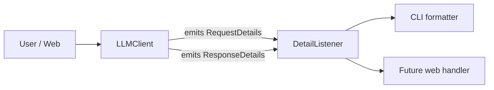

# Plan: Request/Response details for the CLI (interface-agnostic)

## Goal

Add a CLI key (`--details`) that prints diagnostics for a request:

- the URL the request is sent to,
- the model used,
- the fully formed request body (payload),
- token usage, when the provider reports it.

The capability must NOT live only in the CLI. A future web interface must be able
to reuse the same mechanism. Therefore all detail collection lives in the service
layer (`LLMClient`), and each interface just plugs in its own consumer.

## Design overview

Introduce an **event listener** hook on `LLMClient`. The client emits structured
"request prepared" and "response received" events; the CLI registers a listener
that formats and prints them. A web app would register its own listener (e.g. to
store/return the metadata) with zero changes to the core request logic.

This mirrors the existing pluggable patterns already in the codebase:
`transport=` injection and the `TokenProvider` protocol.



## Changes

### 1. New module `llm_bot/diagnostics.py`

Define the data contracts + listener protocol:

- `RequestDetails` dataclass — `method`, `url`, `model`, `payload`.
- `ResponseDetails` dataclass — `status_code`, `usage` (dict or None),
  `elapsed_ms`, `attempt` (1-based attempt number this response belongs to).
- `DetailListener` protocol with two methods:
  - `on_request(details: RequestDetails) -> None`
  - `on_response(details: ResponseDetails) -> None`
- Helper to extract `usage` from a chat-completions response dict (returns
  `None` when absent, since not all providers report it).

### 2. `llm_bot/client.py`

- Add `detail_listener: DetailListener | None = None` to `LLMClient.__init__`.
- Extract `_build_url()` helper → `base_url.rstrip("/") + _CHAT_ENDPOINT`.
- Refactor `_execute_with_retry` / `_request`:
  - build `url` + `payload` once before the retry loop,
  - if a listener is set, emit `on_request(RequestDetails(...))` once,
  - pass the current 1-based `attempt` into `_request`,
  - after each HTTP attempt, emit `on_response(ResponseDetails(...))` with
    status, parsed usage, `attempt`, and `elapsed_ms` (measured around
    `client.post`) — emitted for both successful and transient/error responses,
    so the output shows every attempt,
  - keep all existing error/retry behavior unchanged.
- `send_prompt` still returns only the text (public API unchanged); details go
  through the listener only.

### 3. `llm_bot/cli.py`

- Add `--details` flag (distinct from existing `-v/--verbose`, which controls
  logging level).
- Add a small private `_DetailPrinter(DetailListener)` that prints a readable
  block to **stderr** so stdout stays clean for the actual reply:
  ```
  [details] POST <url>
  [details] model: <model>
  [details] request body: <json>
  [details] attempt 1: HTTP <status> in <elapsed>ms
  [details] usage: prompt=X completion=Y total=Z     (only if present)
  ```
  Because `on_response` fires per attempt, transient failures (e.g. HTTP 503)
  appear as their own `attempt N` lines, followed by a later successful attempt.
- Wire `detail_listener=_DetailPrinter()` into both the `openai`
  (`LLMClient`) and `gigachat` (`build_gigachat_client`) paths when `--details`
  is set.

### 4. `llm_bot/gigachat.py`

- Extend `build_gigachat_client` to accept and forward `detail_listener` to the
  underlying `LLMClient`. Keeps the gigachat path symmetric with the openai path.

### 5. Tests — `tests/test_client.py`

- Add `test_detail_listener_receives_request_and_usage`:
  - mock response includes a `usage` block
    (`{"prompt_tokens": 5, "completion_tokens": 7, "total_tokens": 12}`),
  - assert the listener got a `RequestDetails` with the correct `url`, `model`,
    `payload`, and a `ResponseDetails` with the parsed `usage`, `status_code`,
    `attempt`, and a non-negative `elapsed_ms`.
- Add `test_detail_listener_reports_each_attempt`:
  - mock returns 503 then 200,
  - assert the listener received two `on_response` events with `attempt` 1 and 2.
- Add a test that `usage` is `None` when the provider omits it.

### 6. Docs & exports

- Update `README.md` (Usage section): document `--details`.
- Optionally export the new types from `llm_bot/__init__.py`.

## Notes / decisions

- **Interface-agnostic**: detail collection is a listener on the service layer;
  CLI rendering is a thin adapter. The README's "Adding a web interface" section
  can be updated to show a web handler reusing `DetailListener`.
- **Secrets**: we emit the request body (messages + model), not the `Authorization`
  header, so API keys are never printed.
- **Retries**: `on_request` fires once per `send_prompt`; `on_response` fires per
  HTTP attempt (including transient/error responses), carrying `attempt` and
  `elapsed_ms`. This gives a clear picture of retries: each failed attempt is
  visible, then the final success. Only the final successful response's `usage`
  is meaningful, but every attempt's status/time is reported.
- **Non-breaking**: `send_prompt`'s return type and all existing tests stay
  valid.