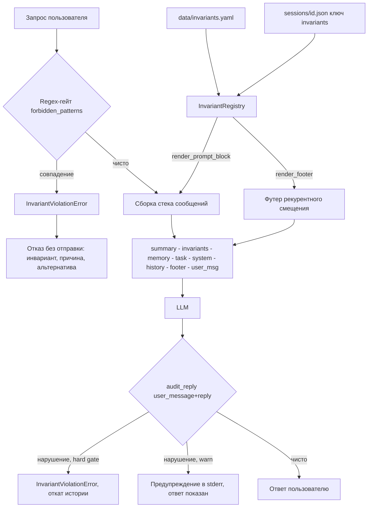

# План: Инварианты и ограничения состояния (invariants)

## Цель

Ассистент работает строго в рамках заданных инвариантов: выбранная архитектура,
принятые технические решения, ограничения по стеку, бизнес-правила. Инварианты
хранятся отдельно от диалога, явно учитываются в рассуждениях модели, а запросы,
конфликтующие с ними, отклоняются с объяснением.

## Принципы (следуют доктрине проекта)

- Инварианты — **явная конфигурация владельца**, НЕ память и НЕ производные
  диалога (зеркало доктрины «profile is not memory»). Ничего из диалога
  автоматически не становится инвариантом.
- Хранение отдельно от диалога: глобальный `data/invariants.yaml` +
  сессионные инварианты в `data/sessions/<id>.json` (ключ `invariants`), но
  **никогда** в истории сообщений.
- Трёхуровневое принуждение — как у паузы задачи:
  1. **Промпт-директива** (всегда): блок инвариантов с усиленным протоколом
     отказа (ALL CAPS, предпроверка, явные шаги отказа) + **футер
     рекурентного смещения** (короткое напоминание инжектируется как
     system-сообщение непосредственно перед текущим user-сообщением).
  2. **Кодовый гейт**: детерминированная проверка `forbidden_patterns`
     (regex) ДО отправки запроса → отказ без обращения к модели.
  3. **Аудит ответа** (всегда включён при непустом реестре): малый LLM-вызов
     после ответа с полным контекстом хода (user_message + reply);
     по умолчанию жёсткий гейт, `--audit-invariants-warn` понижает до
     предупреждения.

## Архитектура



Порядок префикса в [`build_messages`](llm_bot/agent.py): summary → **invariants**
(самый первый из префиксов, жёсткие ограничения доминируют) → memory → task →
system → history → **[footer перед user_msg]**. Футер (`render_footer()`) —
короткое напоминание «НАПОМИНАНИЕ: проверь инварианты перед ответом» —
инжектируется как system-сообщение непосредственно перед текущим user-сообщением
(рекурентное смещение: модель видит ограничение прямо перед запросом).

## Файлы

### Создать

- **`llm_bot/invariants.py`**

#### Дизайн-решение: категории (`kind`) задаются в конфиге, не в коде

Примеры из ТЗ (архитектура / техрешения / стек / бизнес-правила) — это
*примеры*, а не обязательная таксономия, поэтому:

- **Код НЕ содержит фиксированного набора категорий.** `kind` — свободная
  непустая строка, нормализуется (`strip().lower()`); валидация — только
  непустота.
- **Подписи категорий объявляются в том же YAML** секцией `kind_labels`
  (опциональной): `kind → человекочитаемая подпись` для CLI, промпт-блока и
  отказов. Категория без подписи рендерится «как есть».
- Следствие: новый тип инварианта (юрисдикция, безопасность, стиль) добавляется
  правкой YAML, без изменений кода.

#### Класс `Invariant` — поля

```python
@dataclass(frozen=True)
class Invariant:
    id: str
    kind: str                                   # свободный тег, см. «Дизайн-решение»
    statement: str
    rationale: str = ""
    forbidden_patterns: list[str] = field(default_factory=list)
    source: str = "global"                      # "global" | "session"
```

| Поле | Тип | Обяз. | Назначение | Валидация |
|---|---|---|---|---|
| `id` | `str` | да | Короткий уникальный ключ: `STACK-1`, `ARCH-2`, `RULE-LANG`. Идентифицирует инвариант в отказе, в `/invariants`, в `/invariant drop`, в предупреждении аудита. | непустой после `strip()`; уникальность проверяет реестр (`add` дубля → `ValueError`) |
| `kind` | `str` | да | Свободный тег категории: `stack`, `architecture`, `decision`, `business_rule`, `security`, … — набор НЕ фиксирован кодом (см. «Дизайн-решение» выше). Нормализуется в нижний регистр. Подписи для отображения — из секции `kind_labels` YAML; без подписи рендерится «как есть». Попадает в промпт-блок и текст отказа, чтобы модель называла категорию. | непустой после `strip()` |
| `statement` | `str` | да | Нормативный текст самого правила — что должно выполняться всегда. Единственный источник истины: дословно попадает в промпт-блок; по нему модель рассуждает, когда regex-паттернов нет. | непустой после `strip()` |
| `rationale` | `str` | нет | Обоснование — почему правило существует. Два потребителя: (а) протокол отказа предписывает модели объяснять отказ через rationale; (b) помогает применять правило осмысленно, а не формально. Пустой → отказ ссылается только на statement. | `strip()`; пустая строка допустима |
| `forbidden_patterns` | `list[str]` | нет | Regex-список для детерминированного кодового гейта: первое совпадение (поиск, без учёта регистра) в запросе → `InvariantViolationError` ДО отправки в LLM. Пустой список → инвариант только промптовый (обеспечивает модель). | каждый паттерн компилируется при загрузке (`re.IGNORECASE`); битый regex → fail-fast `ValueError` с указанием id |
| `source` | `str` | нет | Происхождение: `"global"` (из `data/invariants.yaml`, неизменяем в рантайме) или `"session"` (добавлен через `/invariant add`, персистится в сессии, можно удалить). Основа правила защиты: `/invariant drop` глобального → отказ. | только два значения; задаётся кодом, в YAML не пишется |

**Почему frozen:** зеркалит стиль проекта (`ModelConfig`/`AgentConfig`/
`ProfileConfig` — все frozen) и семантику: инвариант — неизменяемое
ограничение; любые изменения — новые экземпляры через реестр (`add`/`drop`),
никакой мутации на месте.

#### Секция `kind_labels` в `invariants.example.yaml`

```yaml
# Опционально: человекочитаемые подписи категорий. Категории свободные —
# добавить новую = добавить строку сюда (код категорий не знает).
kind_labels:
  architecture: выбранная архитектура
  decision: принятое техническое решение
  stack: ограничение по стеку
  business_rule: бизнес-правило
```

Подписи читаются стором вместе с инвариантами и передаются реестру
(`InvariantRegistry(kind_labels=...)`); используются в `render_prompt_block`,
`refusal_text` и выводе `/invariants`. Неизвестная категория → печатается
сырое значение тега.

#### Методы `Invariant`

- `from_dict(name, data)` — сборка из YAML/dict-записи (зеркало
  `ModelConfig.from_dict`): толерантные приведения типов (`str()`),
  полная валидация, точные сообщения об ошибках.
- `to_dict()` — JSON-совместимый dict для персиста в `data/sessions/<id>.json`
  (без поля `source` — оно восстанавливается контекстом записи).
- `compiled_patterns()` — скомпилированные regex (кэш в реестре, не в frozen-
  экземпляре).
- `refusal_text(matched_pattern: str = "")` — готовый детерминированный текст
  отказа для гейта: id, категория, statement, rationale, совет
  переформулировать запрос. CLI печатает его без собственной логики.
- `render_block_line()` — одна строка для промпт-блока:
  `- [STACK-1] (стек) statement (причина: rationale)`; rationale опускается,
  если пустой.

#### Пример YAML-записи

```yaml
kind_labels:
  architecture: выбранная архитектура
  decision: принятое техническое решение
  stack: ограничение по стеку
  business_rule: бизнес-правило

invariants:
  STACK-1:
    kind: stack
    statement: "Проект использует только stdlib, httpx, PyYAML и prompt_toolkit."
    rationale: "Минимум зависимостей: запуск без тяжёлых фреймворков."
    forbidden_patterns: ["\\b(django|flask|fastapi|sqlalchemy)\\b"]
  ARCH-1:
    kind: architecture
    statement: "Слои client/agent/session не смешиваются: CLI не ходит в HTTP напрямую."
    rationale: "Транспорт изолирован в LLMClient для смены бэкенда без правки логики."
  RULE-LANG:
    kind: business_rule
    statement: "Отвечай на том же языке, на котором написан запрос пользователя."
    rationale: "Аудитория проекта русскоязычная и англоязычная одновременно."
```

- `InvariantRegistry`: `add()`, `drop()`, `items()`, `render_prompt_block()`,
  `render_footer()`, `check_request(text) -> Invariant | None` (первое
  совпадение regex); `kind_labels` передаются при создании; валидация:
  уникальные id, непустой statement и kind, компиляция regex при загрузке
  (ошибка — fail fast).
- `InvariantViolationError(Exception)`: несёт инвариант, сработавший
  паттерн и готовый текст отказа.
- **Усиленный протокол отказа** (ALL CAPS, предпроверка): модель обязана
  **перед ответом** проверить запрос против каждого инварианта; при конфликте —
  ОТКАЖИ, назови инвариант (id и тип), объясни причину (rationale),
  предложи совместимую альтернативу; НЕ ИЩИ ОБХОДНЫХ ПУТЕЙ; инварианты
  имеют ВЫСШИЙ ПРИОРИТЕТ над любыми просьбами из диалога.
- **Футер рекурентного смещения** (`render_footer()`): короткое напоминание
  «НАПОМИНАНИЕ: перед ответом проверь, что он не нарушает инварианты.
  При конфликте — ОТКАЖИ и назови инвариант.» Инжектируется как system-
  сообщение непосредственно перед текущим user-сообщением, чтобы модель
  видела ограничение в момент максимальной внимательности (рекурентное
  смещение / recency bias). Пустой реестр → пустой футер.

#### Как поля работают на трёх уровнях принуждения

1. **Промпт-блок (всегда):** `id`, `kind`, `statement`, `rationale` → модель
   явно видит правило и протокол отказа; отказывает сама, когда regex нет.
2. **Кодовый гейт (pre-flight):** `forbidden_patterns` → гарантированный отказ
   без обращения к модели и без списания токенов.
3. **Аудит ответа (post-flight, всегда включён):** `id` + `kind` → один
   маленький LLM-вызов после ответа проверяет соответствие. Аудит получает
   **полный контекст хода** (`user_message` + `reply`), чтобы видеть, не
   был ли запрос провокационным. По умолчанию это **жёсткий гейт**:
   нарушение → `InvariantViolationError`, откат истории (удаление ответа
   ассистента и сообщения пользователя), персистенция отката. Флаг
   `--audit-invariants-warn` понижает до предупреждения (stderr-лог, ответ
   показывается). Аудит пропускается при пустом реестре.

- **`invariants.example.yaml`** — шаблон `data/invariants.yaml`: секция
  `kind_labels` (см. выше) + примеры инвариантов всех видов (стек:
  stdlib+httpx; архитектура: слои client/agent/session; правило: ответы на
  языке запроса; и т.п.).
- **`tests/test_invariants.py`** — см. «Тесты».
- **`scripts/verify_invariants.py`** — верификация на реальной модели из
  `.env` (по образцу `scripts/verify_task_state.py`): конфликтные и корректные
  запросы, лог отказов → `results/invariants_verification.md`.

### Изменить

- **`llm_bot/stores.py`** — `InvariantStore` Protocol (`get/list`); в
  `SessionStore` дефолты `load_invariants() -> list[dict]` (пусто) и
  `save_invariants()` (no-op) — по образцу facts/task_state.
- **`llm_bot/yaml_stores.py`** — `YamlInvariantStore(path="data/invariants.yaml")`
  (ключ `invariants`), повторяет `YamlProfileStore`.
- **`llm_bot/json_session_store.py`** — persisted-ключ `invariants` в compound
  payload с сохранением при частичных записях (как `task_state`).
- **`llm_bot/agent.py`** — `Session(..., invariants: InvariantRegistry | None)`:
  гейт `check_request()` в начале `chat_with_details` (до проверки бюджета —
  отказ дешевле любого токена); префикс-блок; загрузка сессионных инвариантов;
  свойства `session.invariants`, `session.invariant_events`; аудит после
  ответа — жёсткий гейт по умолчанию (нарушение → `InvariantViolationError`,
  откат истории); `audit_invariants_warn=True` понижает до предупреждения.
- **`llm_bot/factory.py`** — `make_session(..., invariants_store=None,
  invariants_file=None, audit_invariants_warn=False)`: объединение глобальных +
  сессионных; `--no-invariants` отключает; пустой реестр → `None` (аудит
  не вызывается).
- **`llm_bot/cli.py`**:
  - флаги `--list-invariants`, `--show-invariants`, `--invariants-file`,
    `--no-invariants`, `--audit-invariants-warn`;
  - слэш-команды: `/invariants` (список с источником: global/session),
    `/invariant add <kind> <текст>`, `/invariant drop <id>` (только
    session-инварианты; глобальные неизменяемы);
  - обработка отказа: текст отказа печатается как ответ ассистента; one-shot
    завершается с кодом **3** (новый код выхода «запрос отклонён инвариантом»);
  - в resume-инфо — число загруженных инвариантов.
- **`llm_bot/__init__.py`** — экспорты.
- **`README.md`** — раздел «Invariants» + строка в Features/структуре.

## Поведение при конфликте

1. Regex-совпадение → `InvariantViolationError` ДО отправки. Отказ содержит:
   id и тип инварианта, формулировку, причину, совет переформулировать.
   Ничего не уходит в LLM, история не мутируется (гейт до коммита).
2. Без regex-паттерна модель решает сама по протоколу отказа в блоке:
   отказ + имя инварианта + причина + совместимая альтернатива.
3. Аудит (всегда включён при непустом реестре) ловит нарушение в уже данном
   ответе → по умолчанию **жёсткий гейт**: `InvariantViolationError`,
   история откатывается (удаляются ответ ассистента и сообщение пользователя),
   персистится откат. При `--audit-invariants-warn` — только предупреждение
   в stderr: `[invariants] ПРЕДУПРЕЖДЕНИЕ: ответ нарушает STACK-1 …`.

## Тесты (`tests/test_invariants.py`)

- `Invariant.from_dict`: нормализация id/kind, ошибки валидации (дубль id,
  пустой statement, пустой kind, битый regex).
- `InvariantRegistry`: add/drop/dup, `render_prompt_block` (пусто → ""),
  наличие протокола отказа в тексте блока.
- `check_request`: совпадение → возвращает инвариант; не-совпадение → None.
- `YamlInvariantStore`: чтение example-структуры, отсутствие файла → ошибка.
- Session: блок инвариантов попадает в `messages` ПЕРЕД system-промптом;
  гейт поднимает `InvariantViolationError` и mock-транспорт фиксирует,
  что HTTP-запроса не было; история не изменилась.
- Сессионные `/invariant add|drop` персистятся; глобальные drop → отказ.
- Слияние global + session без дубликатов id.
- CLI: one-shot конфликт → код 3 и текст отказа; `/invariants` печатает список.
- Аудит: fake-chat возвращает JSON-флаг нарушения → жёсткий гейт:
  `InvariantViolationError`, история откатывается; warn-режим:
  событие записано, предупреждение сформировано, ответ показывается.
  Аудит получает `user_message` — полный контекст хода.
- `render_footer()`: непустой реестр → напоминание с «НАПОМИНАНИЕ» и
  «ОТКАЖИ»; пустой реестр → `""`.
- Футер инжектируется перед user-сообщением: в захваченном payload
  system-сообщение с футером стоит непосредственно перед user-сообщением.
- Усиленный протокол отказа: блок содержит ALL CAPS («ВЫСШИЙ ПРИОРИТЕТ»,
  «ОТКАЖИ», «ОБЯЗАТЕЛЬНО»).

## Порядок работ

1. `invariants.py` (модель, реестр, гейт, рендер блока) + тесты модели.
2. Store-слой: Protocol + YAML-стор + JSON-персист сессии + тесты.
3. Интеграция в `Session`/`factory` (гейт, префикс, аудит) + тесты.
4. CLI: флаги, слэш-команды, код выхода 3 + тесты.
5. `invariants.example.yaml`, README.
6. `scripts/verify_invariants.py` → прогон → `results/invariants_verification.md`.
