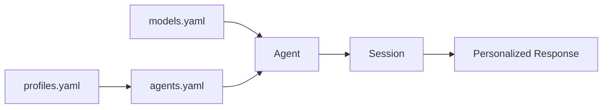
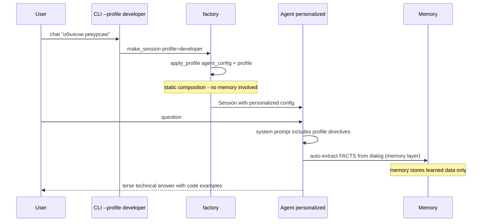
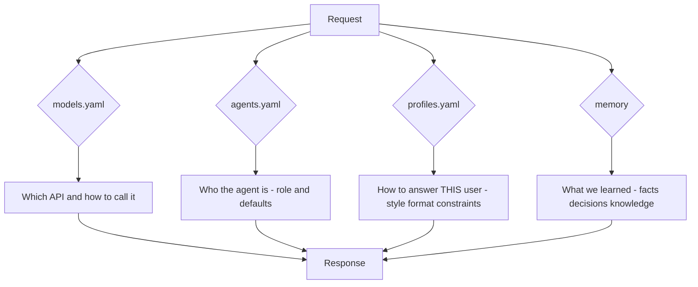

# Personalization: Profile as Orchestration Config

> **CLI note (corrected after review).** The bot today is a flat
> `argparse` CLI: `python -m llm_bot --agent assistant [--session ID]
> [--strategy sliding] ...`. There are NO subcommands (`llm-bot chat ...`,
> `llm-bot profiles list`). The plan therefore does NOT introduce a
> subcommand-based CLI — it adds flags/flags-only in the existing style:
>
> ```bash
> python -m llm_bot --agent assistant --profile developer   # chat as developer
> python -m llm_bot --agent assistant                       # unchanged, no profile
> python -m llm_bot --list-profiles                         # mirror of --list-agents
> python -m llm_bot --show-profile developer                # inspect one profile
> ```
>
> `--profile NAME` validates against `data/profiles.yaml` and errors with the
> list of available profiles when unknown (mirrors how an unknown agent name
> behaves today). No changes to the launch command the user already uses.

## Core Insight (v2 — redesigned)

**The distinction that drives this design:**

| | Memory | Profile |
|---|---|---|
| Nature | What we **accumulate** during interaction | How we **configure** agents for a task/user |
| Lifetime | Grows over time (facts, decisions) | Static definition, edited by maintainer |
| Source | Learned from dialog (auto-extraction) | Declared in YAML config |
| Analogy | Notebook | Lens / operating mode |
| Storage | `data/memory/` (runtime data) | `data/profiles.yaml` (config file) |

The profile is **orchestration configuration**, the third config layer in the
existing pattern:



- `models.yaml` — **how to reach** the LLM (transport)
- `agents.yaml` — **what** the agent does (role, prompt, generation settings)
- `profiles.yaml` — **how the agent behaves for this user/task** (style, format, constraints)

## What Was Wrong With v1

v1 stored profiles inside long-term memory (`user_profile` key). That conflated
two different concerns:

1. **Memory** would then contain *configuration* — but memory is for *learned
   data*. A style preference written into memory looks the same as a fact the
   assistant extracted from a dialog; it competes with working data, gets
   rendered by the same `prefix_messages()` path, and cannot be versioned or
   reviewed like config.
2. **Profiles** are not earned through conversation — they are *declared
   upfront*, like agents and models. They belong in `data/profiles.yaml`,
   visible in the Open Tabs next to `agents.example.yaml`, editable, diffable,
   testable.

## New Architecture

### 1. Config layer — `data/profiles.yaml` (new file, from `profiles.example.yaml`)

```yaml
# Copy to data/profiles.yaml. Profiles define HOW agents behave for a given
# user or task. They do NOT store history or facts (that is memory's job).
profiles:
  developer:
    name: "Разработчик"
    description: "Технический пользователь, ценит краткость и точность"
    style: technical            # formal | casual | technical | friendly | professional
    format: concise             # concise | detailed | structured | bullet_points
    expertise: expert           # beginner | intermediate | expert
    language: ru                # response language (overrides "answer in user's language")
    max_response_words: 200     # constraint: brevity cap
    temperature: 0.3            # optional: deterministic, precise answers
    extra_instructions: "Приводи примеры кода на Python. Используй термины без упрощений."
    forbidden_topics: []        # topics to avoid
    interests: [python, architecture, databases]

  student:
    name: "Студент"
    style: friendly
    format: structured
    expertise: beginner
    language: ru
    max_response_words: null    # no cap — explain fully
    extra_instructions: "Объясняй пошагово, приводи аналогии, избегай жаргона."
    forbidden_topics: []
    interests: []

  child:
    name: "Ребёнок"
    style: friendly
    format: conversational
    expertise: beginner
    language: ru
    max_response_words: 100
    extra_instructions: "Простые слова, короткие предложения, добрый тон."
    forbidden_topics: ["насилие", "оружие"]
    interests: [космос, динозавры, игры]
```

### 2. Dataclass + Store protocol — `llm_bot/stores.py`

Follow the exact existing pattern (`ModelConfig`/`AgentConfig`, `ModelStore`/`AgentStore`):

```python
@dataclass(frozen=True)
class ProfileConfig:
    """Orchestration-level personalization: HOW the agent behaves for a user."""
    name: str
    style: str = ""                 # communication style
    format: str = ""                # response format
    expertise: str = ""             # expertise level
    language: str = ""              # response language
    max_response_words: int | None = None
    temperature: float | None = None
    extra_instructions: str = ""
    forbidden_topics: list[str] = field(default_factory=list)
    interests: list[str] = field(default_factory=list)

    @classmethod
    def from_dict(cls, name: str, data: dict[str, Any]) -> "ProfileConfig": ...

    def to_prompt_block(self) -> str:
        """Render the profile as a system-prompt fragment (deterministic)."""
        ...

    def override_system_prompt(self, base: str) -> str:
        """Compose base agent prompt + profile directives."""
        ...


@runtime_checkable
class ProfileStore(Protocol):
    def get(self, name: str) -> ProfileConfig: ...
    def list(self) -> list[str]: ...
```

### 3. YAML implementation — `llm_bot/yaml_stores.py`

```python
class YamlProfileStore:
    """Loads ProfileConfig entries from profiles.yaml (key 'profiles')."""
    def __init__(self, path: str = "data/profiles.yaml") -> None:
        self._file = _YamlFile(path, "profiles")
    def get(self, name: str) -> ProfileConfig:
        return ProfileConfig.from_dict(name, self._file.item(name))
    def list(self) -> list[str]:
        return self._file.names()
```

### 4. Composition — `llm_bot/factory.py` (the key integration point)

The profile is applied **at composition time**, producing a *personalized
agent config* via `dataclasses.replace` (AgentConfig is frozen):

```python
def apply_profile(agent: AgentConfig, profile: ProfileConfig) -> AgentConfig:
    """Compose agent config with a profile — a new 'lens' on the same agent.

    Orchestration-level override: the profile may tighten generation settings
    and extend the system prompt. Memory is untouched.
    """
    return dataclasses.replace(
        agent,
        system_prompt=profile.override_system_prompt(agent.system_prompt),
        max_response_words=(
            profile.max_response_words
            if profile.max_response_words is not None
            else agent.max_response_words
        ),
        temperature=(
            profile.temperature
            if profile.temperature is not None
            else agent.temperature
        ),
    )
```

In `make_session(...)` add `profile: str | None = None, profile_store: ProfileStore | None = None`:

```python
agent_config = agent_store.get(agent_name)
if profile is not None:
    profile_store = profile_store or YamlProfileStore()
    agent_config = apply_profile(agent_config, profile_store.get(profile))
# ... then build client/agent from the personalized config as usual
```

**Why composition-time, not request-time?** The profile is static config.
Applying it once at session creation means:

- zero per-request overhead (no extra LLM calls, no prefix re-rendering);
- the personalized system prompt is *visible* in `agent.config` — debuggable;
- token accounting already includes the personalized prompt automatically;
- works with ALL existing features (compression, strategies, memory) unchanged.

### 5. CLI — `llm_bot/cli.py` (existing flat argparse, NO new subcommands)

Add to `build_parser()` next to `--strategy` / `--owner`:

```python
parser.add_argument(
    "--profile",
    default=None,
    metavar="NAME",
    help="Personalization profile from data/profiles.yaml (style, format, "
    "constraints). Applied on top of the agent config at composition time.",
)
parser.add_argument(
    "--list-profiles",
    action="store_true",
    help="List the names of all defined profiles and exit.",
)
parser.add_argument(
    "--show-profile",
    default=None,
    metavar="NAME",
    help="Show one profile's settings and exit.",
)
```

In `main()` — mirror the existing `--list-agents` early-exit pattern:

```python
if args.list_agents:
    return _print_agents()
if args.list_profiles:                      # NEW, same pattern
    return _print_profiles()
if args.show_profile:                       # NEW, same pattern
    return _show_profile(args.show_profile)
```

And pass through to the agent path (alongside `strategy_override`, `owner_id`):

```python
return _run_agent_chat(
    args.agent,
    ...,
    owner_id=args.owner,
    profile_name=args.profile,              # NEW
)
```

`_run_agent_chat` forwards it to `make_session(..., profile=profile_name)`.
Unknown profile → clean error message listing available profiles.

**User-visible launch commands remain exactly as today** — only a new optional
flag is added; every existing invocation keeps working unchanged.

### 6. Relationship with memory (both coexist, cleanly separated)



Every turn: the **profile** (config) shapes *how* the agent answers; the
**memory** (runtime) accumulates *what* was learned. A memory fact can never
override or masquerade as profile configuration.

## What Each Piece Answers



## Implementation Steps (code mode)

1. **`llm_bot/stores.py`** — add `ProfileConfig` (frozen dataclass, `from_dict`,
   `to_prompt_block`, `override_system_prompt`) and `ProfileStore` protocol.
2. **`llm_bot/yaml_stores.py`** — add `YamlProfileStore` (reuses `_YamlFile`).
3. **`llm_bot/profiles.py`** — **rewrite**: delete the memory-based v1;
   keep only the `apply_profile(agent_config, profile) -> AgentConfig`
   composition function (+ prompt rendering helpers if not in stores.py).
4. **`llm_bot/factory.py`** — `make_session(..., profile=None,
   profile_store=None)`; apply profile to `AgentConfig` before `make_agent`.
5. **`llm_bot/cli.py`** — `--profile` flag on the agent path + `--list-profiles`
   / `--show-profile NAME` flags (flat argparse, mirroring `--list-agents`).
6. **`profiles.example.yaml`** — example with 3 profiles (developer, student, child).
7. **`tests/test_profiles.py`** — new: ProfileConfig parsing, prompt rendering,
   apply_profile overrides, YamlProfileStore, CLI flags.
8. **`tests/test_agent.py` / `test_cli.py`** — extend: profile wiring in factory.
9. **`scripts/compare_profiles.py`** — run the same question through 2–3
   profiles and dump side-by-side answers to `results/profiles_*.md`
   (follows the existing `compare_*` script convention).
10. **`README.md`** — profiles section.

## Verification Plan (maps to the task's "Проверьте")

1. **Answers differ per profile** — `scripts/compare_profiles.py` sends the
   identical question (e.g. "расскажи про рекурсию") via `developer`,
   `student`, `child`; results written to `results/compare_profiles.md` show:
   developer → terse + code; student → step-by-step + analogies; child →
   simple words, short.
2. **Automatic application** — unit test asserts `session.agent.config.system_prompt`
   contains profile directives and `max_response_words`/`temperature` overrides
   took effect; CLI `--profile` end-to-end test.
3. **Memory untouched** — assert profile never appears in
   `data/memory/**`; memory extraction still writes only dialog-derived facts.
4. **Unknown profile** → clear error listing available profiles (mirrors
   `_YamlFile.item()` KeyError behavior).

## Success Criteria

- [ ] `data/profiles.yaml` (from example) fully drives personalization
- [ ] Same agent + different profile → observably different answers
- [ ] `--profile` absent → behavior identical to current system (backward compatible)
- [ ] Memory layer contains zero profile data (strict separation)
- [ ] Profiles are reviewed/versioned like all other config (diffable YAML)
- [ ] All existing tests pass; new tests cover profile path
