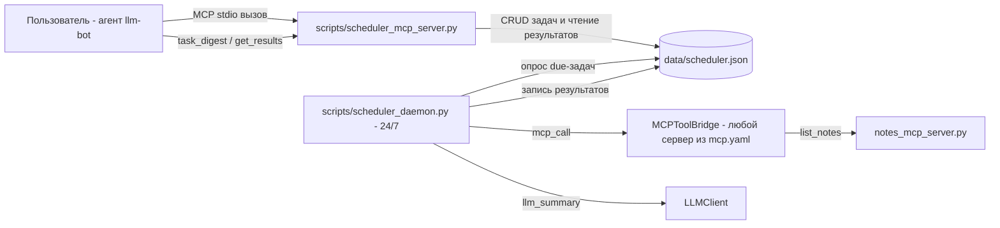

# План: Планировщик и фоновые задачи (MCP + демон 24/7)

## Цель

MCP-инструмент с отложенным и периодическим выполнением: reminder, периодический
сбор данных, регулярный summary. Инструмент сохраняет данные (JSON),
выполняет действия по расписанию и возвращает агрегированный результат.
Итог — агент, который работает 24/7 и периодически выдаёт сводку.

## Ключевое архитектурное решение

[`MCPToolBridge._run`](../llm_bot/mcp_tools.py) порождает stdio-сервер **на
каждый вызов** и закрывает его после ответа. Значит планировщик нельзя поместить
внутрь MCP-сервера — процесс умрёт вместе с расписанием.

Решение — два независимых процесса над общим хранилищем:

1. **stateless MCP-сервер** (`scripts/scheduler_mcp_server.py`) — «пульт
   управления»: CRUD задач и чтение результатов. Перезапускается сколько
   угодно — состояние живёт в файле;
2. **долгоживущий демон** (`scripts/scheduler_daemon.py`) — исполнитель 24/7:
   опрашивает хранилище, запускает due-задачи, пишет результаты, догоняет
   пропущенные запуски после простоя.



## Семантика задач (согласовано в обсуждении)

- **Задачи-сборщики** — по одной на источник данных, у каждой свой период
  (`once` / `interval` / `daily`) и группа (`group`, например «финансы»).
- **Получение информации** — задач не требует: вопрос в чат → `task_digest()`
  агрегирует журнал по всем/группе/одной задаче.
- **Регулярные сводки** (`llm_summary`) — по одной на каждый желаемый
  «срез × расписание»: «за завтраком сериалы в 8:00», «в обед курс в 13:00».
  `payload.sources` — `"all"`, список групп или список id задач; одна сводка
  может охватывать сколько угодно сборщиков.
- **Действие `mcp_call`** — универсально: вызвать любой инструмент любого
  сервера из `data/mcp.yaml`. Новые сценарии (курс валют, эпизоды) добавляются
  конфигом, а не кодом демона.

## Компоненты

### 1. `llm_bot/scheduler.py` — ядро

```python
@dataclass(frozen=True)
class ScheduledTask:
    id: str                     # короткий uuid
    title: str                  # человекочитаемое имя
    action: str                 # mcp_call | reminder | llm_summary
    schedule: dict              # {"kind": "once", "delay_seconds": N}
                                # {"kind": "interval", "every_seconds": N}
                                # {"kind": "daily", "at": "HH:MM"}
    payload: dict               # аргументы действия (server/tool/arguments, текст...)
    group: str                  # свободная группировка для дайджестов
    status: str                 # active | paused | done | cancelled
    created_at / next_run / last_run: str  # UTC ISO

@dataclass(frozen=True)
class TaskResult:
    task_id / run_at / ok: ...
    summary: str                # агрегат или текст reminder
    details: dict               # сырые данные прогона

class JsonSchedulerStore:       # data/scheduler.json
    # атомарная запись tmp+rename (как notes_api._save)
    # МЕЖПРОЦЕСНАЯ блокировка fcntl.flock на lock-файле
    # (MCP-серверы и демон — разные процессы!)
    add_task / get_task / list_tasks / update_task / cancel_task
    pause_task / resume_task
    append_result / list_results / iter_due

def next_run_after(schedule, now) -> datetime   # чистая функция расписания
def advance(task, now) -> task                  # пересчёт next_run после прогона
```

Расписание — чистые функции с инъекцией `now` (тестируемость без sleep).
Время хранится в UTC; daily интерпретируется в локальной зоне демона.

### 2. Исполнители действий (реестр `ACTIONS` в демоне)

| action | что делает | через MCP? |
|---|---|---|
| `mcp_call` | вызвать `payload.server__tool` с `payload.arguments` | ✅ да |
| `reminder` | результат = текст из payload | — не нужен |
| `llm_summary` | агрегирует результаты задач-источников, один LLM-запрос | — LLM напрямую |

`llm_summary` без настроенной модели деградирует в детерминированную сводку
(счётчики + последние N записей) — тесты идут без сети, как принято в проекте.
Отказ действия → `TaskResult(ok=False)`; демон продолжает работать.

### 3. `scripts/scheduler_mcp_server.py` — MCP-инструменты

FastMCP, шаблон [`notes_mcp_server.py`](../scripts/notes_mcp_server.py):

- `schedule_task(title, action, payload, delay_seconds? | every_seconds? |
  daily_at?, group?)` → id;
- `list_tasks(status?)` → таблица задач;
- `cancel_task` / `pause_task` / `resume_task(task_id)`;
- `get_task_results(task_id, limit?)` → журнал прогонов;
- `task_digest(group?|task_id?|last_n?)` → **агрегированный результат**:
  счётчики ok/fail, свежие summaries, ближайшие запуски.

Переменная окружения `SCHEDULER_DB` (как `NOTES_DB`).

### 4. `scripts/scheduler_daemon.py` — исполнитель 24/7

- цикл: тик `--tick` (по умолчанию 5 c), исполняет все due-задачи;
- due-задача → `ACTIONS[action]` → `append_result` → `advance()`
  (once → done; interval → += every; daily → завтра в HH:MM);
- catch-up: пропуск за время простоя не выполняется задним числом —
  задача исполняется один раз при первом тике и сдвигается вперёд;
- graceful shutdown SIGINT/SIGTERM; `--once` — выполнить все due и выйти
  (smoke-тесты и альтернатива «внешний cron вместо демона»);
- `--db`, `--tick`, `--log-file data/scheduler.log`.

Ограничение честно фиксируем: reminder не пушится в терминал чата — он
попадает в журнал результатов, и агент показывает его по запросу
(«что там по напоминаниям?» / `task_digest`).

### 5. Хранилище: JSON против SQLite

По умолчанию **JSON + fcntl** (стиль проекта: читаемый, тестируемый, как
`notes.json`). Опция расширения — `SqliteSchedulerStore` с тем же протоколом
(WAL решает межпроцессные блокировки), отдельным шагом при необходимости.

### 6. Тесты (по образцу существующих)

- `tests/test_scheduler.py` — стор: CRUD, конкурентная запись, next_run для
  трёх видов расписаний, catch-up, `iter_due` с подменой часов;
- `tests/test_scheduler_mcp_server.py` — e2e stdio, как
  [`test_mcp_notes_server.py`](../tests/test_mcp_notes_server.py):
  каталог и схемы, schedule → due (подмена времени) → result → digest;
- smoke демона `--once` с временным `SCHEDULER_DB` в tmp_path.

### 7. Документация и интеграция

- `mcp.example.yaml` — сервер `scheduler`;
- README — раздел «Планировщик и фоновые задачи» + запуск демона;
- `results/mcp_scheduler_verification.md` — отчёт проверки (конвенция results/).

## Шаги реализации

1. `llm_bot/scheduler.py`: модели, JSON-стор с flock, чистые функции расписаний.
2. Действия mcp_call / reminder / llm_summary (+детерминированный фолбэк).
3. MCP-сервер scheduler с пятью инструментами.
4. Демон: цикл, catch-up, `--once`, graceful shutdown.
5. Тесты: стор, e2e MCP, smoke демона.
6. mcp.example.yaml, README, verification-отчёт.
