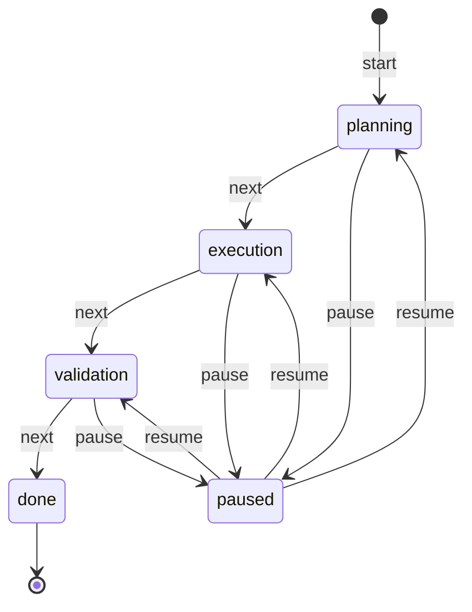

# План: Состояние задачи как конечный автомат (Task State Machine)

## Цель

Формализовать ход работы над задачей как **конечный автомат** с тремя осями:

- **этап задачи** (stage) — `planning → execution → validation → done`;
- **текущий шаг** (step) — произвольный текст, что именно делается сейчас;
- **ожидаемое действие** (expected_action) — что пользователь/агент должен сделать дальше.

Требования ТЗ:

1. **пауза на любом этапе** — `pause()` легален из любого нетерминального состояния;
2. **продолжение без повторных объяснений** — после паузы/перезапуска процесса
   состояние (этап + шаг + ожидаемое действие + журнал) восстанавливается из
   хранилища и **инжектируется в system-контекст модели** на каждом запросе,
   поэтому пользователю достаточно сказать «продолжай».

Результат: агент с формализованным состоянием задачи, пережидающим перезапуск.

## Диаграмма состояний



- `next` — только по таблице легальных переходов; недопустимый переход →
  `TaskIllegalTransitionError` (формализм КДА, а не свободные строки).
- `done` — терминальное состояние: `pause`/`next` из него запрещены.
- `paused` — полноценное состояние автомата, хранит `paused_from` для возврата.

## Компоненты (по сложившимся паттернам проекта)

### 1. Новый модуль `llm_bot/task_state.py`

```python
class TaskStage(str, Enum):
    PLANNING = "planning"
    EXECUTION = "execution"
    VALIDATION = "validation"
    DONE = "done"
    PAUSED = "paused"

TRANSITIONS: dict[TaskStage, tuple[TaskStage, ...]] = {
    PLANNING: (EXECUTION,), EXECUTION: (VALIDATION,),
    VALIDATION: (DONE,), DONE: (), PAUSED: (),
}

@dataclass
class TaskState:            # снимок для персиста и рендеринга
    stage: TaskStage
    step: str = ""
    expected_action: str = ""
    paused_from: TaskStage | None = None
    log: list[str] = field(default_factory=list)   # журнал переходов/шагов

class TaskStateMachine:
    def start(description: str) -> None          # -> planning
    def next_stage() -> None                     # легальный переход вперёд
    def pause() -> None                          # из любого кроме done/paused
    def resume() -> None                         # только из paused
    def set_step(text) / set_expected_action(text) / reset()
    def state() -> TaskState                     # снимок
    def to_dict() / from_dict()                  # JSON-сериализация
    def render_prompt_block() -> str             # блок для system-контекста
```

`render_prompt_block()` печатает: этап, признак паузы, текущий шаг, ожидаемое
действие и последние записи журнала — этого достаточно модели, чтобы продолжить
без повторного объяснения задачи.

### 2. Протокол хранилища — `llm_bot/stores.py`

В `SessionStore` добавляются два метода с **no-op дефолтами** (тот же приём,
что для `facts`/`branches`):

```python
def load_task_state(self, session_id: str) -> dict[str, Any] | None: return None
def save_task_state(self, session_id: str, state: dict[str, Any]) -> None: ...
```

### 3. Персист — `llm_bot/json_session_store.py`

Ключ `task_state` в составном JSON сессии (рядом с `summary` / `facts` /
`branches`); сохранение остальных сущностей не трогает его, и наоборот.

### 4. Интеграция в сессию — `llm_bot/agent.py`

`Session(..., task: TaskStateMachine | None = None)`:

- при создании машина загружает сохранённое состояние из стора;
- в `chat_with_details` блок состояния добавляется в **prefix** каждого запроса
  (тот же механизм, что у durable-memory и sticky-facts: состояние видно модели
  перед system-промптом роли);
- свойства `session.task`, `session.task_state` для CLI и тестов.

### 4a. Автоматическое отслеживание (auto-режим, паттерн `extract_memory`)

Задача создаётся **не только вручную** — агент сам распознаёт её из диалога.
После каждого хода (когда машина включена и включён `task_auto_detect`) делается
маленький LLM-вызов — тот же приём, что `extract_memory` в памяти и обновление
фактов в `StickyFacts`:

```python
detect_task_turn(task, user_msg, reply, chat) -> TaskDetectionEvent
```

- **нет активной задачи** — LLM смотрит пару user → reply и решает, ставит ли
  пользователь задачу, например «напиши скрипт…» или «давай спроектируем…».
  Да → `start(описание)`; шаг и ожидаемое действие заполняются из ответа модели.
- **задача активна** — LLM возвращает JSON-структуру:
  `{"stage_hint": "execution|validation|done|null", "step": "...",
  "expected_action": "...", "paused": bool, "resumed": bool}`;
  применяются только **легальные** переходы из таблицы `TRANSITIONS`
  (нелегальный hint отбрасывается — автомат остаётся формальным), `step` /
  `expected_action` обновляются свободно, `paused`/`resumed` срабатывают на
  фразах вроде «давай паузу» / «продолжай».
- каждое авто-событие записывается в журнал — `TaskDetectionEvent`
  (распознано/нет, что изменилось, расход токенов); свойство
  `session.task_events`, симметрично `session.memory_events`.
- сбой LLM-классификации никогда не ломает ход — try/except, как в памяти.

Ручные команды `/task ...` остаются поверх как **явное переопределение**:
команда приоритетнее авто-детекта и правит состояние напрямую.

### 5. Фабрика — `llm_bot/factory.py`

- `make_session(..., task_state: bool = False, task_auto_detect: bool = True)`
  — включает машину, подключает стор персиста и auto-детект;
- поля `AgentConfig.task_state: bool = False` и
  `AgentConfig.task_auto_detect: bool = True` в `stores.py`
  (симметрично `context_strategy`), парсится из `agents.yaml`.

### 6. CLI — `llm_bot/cli.py`

- флаг запуска `--task-state` (включает машину для сессии, перекрывая конфиг
  агента — симметрично `--strategy`);
- slash-команды в interactive-цикле (по образцу `_handle_branch_command`):

```
/task                      — статус: этап, пауза, шаг, ожидаемое действие
/task start <описание>     — начать задачу (stage=planning)
/task step <текст>         — задать текущий шаг
/task action <текст>       — задать ожидаемое действие
/task next                 — перейти на следующий этап
/task pause                — пауза с любого этапа
/task resume               — продолжить без повторных объяснений
/task reset                — сбросить состояние
```

- `_handle_task_command` парсит подкоманды, вызывает методы машины, ловит
  `ValueError` (нелегальный переход) и печатает в stderr;
- `_task_paused_gate` — жёсткий гейт: обычный ввод чата блокируется до resume;
- **авто-ход при смене этапа** — `_task_auto_turn` отправляет сервисный запрос
  модели после `start`/`next`/`resume` (но не после `pause`), чтобы директива
  этапа действовала немедленно; ответ печатается в чат, `LLMError` не прерывает
  команду.

### 7. Тесты — `tests/test_task_state.py` + `tests/test_cli.py`

**FSM и интеграция** (`test_task_state.py`):
- легальные/нелегальные переходы (`planning→validation` — ошибка);
- **пауза с каждого этапа** (planning / execution / validation — ок; done — ошибка);
- resume восстанавливает исходный этап, шаг, действие и журнал;
- roundtrip `to_dict`/`from_dict`;
- персист через `JsonSessionStore` и восстановление в **новой** `Session`
  (эмуляция перезапуска процесса): prompt-блок содержит этап/шаг/действие —
  «продолжение без повторных объяснений»;
- инжект блока состояния в messages, отправляемые клиенту;
- auto-детект: постановка задачи из диалога, легальный stage_hint применяется,
  нелегальный отбрасывается, пауза/продолжение по фразе, сбой LLM не ломает ход.

**CLI и авто-ход** (`test_cli.py`):
- `/task next` отправляет ровно один сервисный ход;
- `/task resume` отправляет один сервисный ход;
- `/task pause` **не** отправляет сервисный ход (модель не вызывается на паузе);
- ошибка LLM при авто-ходе не прерывает команду, печатается в stderr;
- `/task` (статус) и неизвестные подкоманды не вызывают модель.

### 8. Проверочный скрипт — `scripts/verify_task_state.py`

Проверка на **реальной модели** (из `data/models.yaml`) + отчёт в
`results/task_state_verification.md`: сценарий «пауза → перезапуск → resume →
"продолжай"» с показом итогового system-стека; проверяется, что модель
отказывается работать на паузе и продолжает после resume.

### 9. Документация — `README.md`

Раздел "Task state machine": диаграмма, команды `/task`, двухуровневая пауза,
директивы этапов, авто-заполнение `expected_action`, авто-ход при смене этапа.

## Что НЕ меняется

- Существующие стратегии контекста, компрессия, память, профили — машина
  ортогональна и работает с любым из них (это просто ещё один prefix-источник).
- Обратная совместимость: старые JSON-сессии без ключа `task_state` читаются
  как раньше; `--task-state` не задан → поведение идентично текущему.
