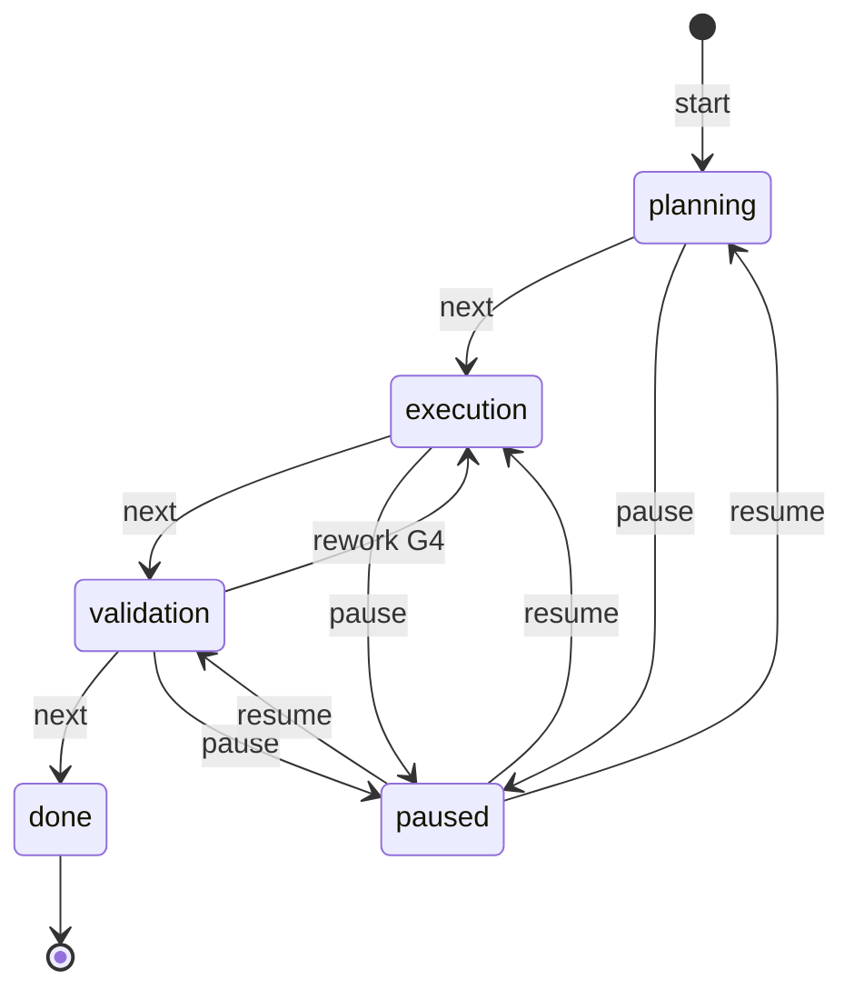

# План: Контролируемые переходы состояний задачи (G1–G4)

## Цель

Довести жизненный цикл задачи до полного соответствия ТЗ «Контролируемые
переходы состояний»: явные допустимые состояния, разрешённые переходы,
невозможность «перепрыгнуть» этап, явная реакция на нелегальные попытки,
корректное продолжение после паузы.

База: [`llm_bot/task_state.py`](../llm_bot/task_state.py) — машина уже есть,
таблица [`TRANSITIONS`](../llm_bot/task_state.py) уже отсекает прыжки
детерминированно. Пробелы — в обратной связи и семантике авто-детекта.

## Согласованная семантика

Конвейер описывает **работу**, а не тип артефакта:
`planning` = план работы (шаги, критерии, вопросы) → `execution` = производство
итогового артефакта → `validation` = проверка артефакта → `done` = сводка.

| Ситуация в диалоге | Реакция системы |
|---|---|
| План работы показан, пользователь одобрил / просит артефакт | авто `stage_hint` = следующий этап (ровно один шаг) |
| Артефакт выхода этапа не показан, «давай сразу итоговый план» | остаёмся в planning; модель доуточняет требования или явно предлагает «/task next по допущениям» |
| «Пропусти проверку / сразу финал / завершай» (прыжок через этап) | hint на недостижимый этап → **явный отказ** с маршрутом: `/task next` → execution → validation → done |

Ручной `/task next` = утверждение плана пользователем (осознанное действие,
автомат содержание не проверяет). Ранний переход виден в журнале через заметку.

## Диаграмма итогового графа (с G4-rework)

## Изменения

### G1 — реакция на нелегальные попытки (главный пробел)

1. [`TaskStateMachine.reject_transition(target, reason="")`](../llm_bot/task_state.py):
   пишет в `log` запись «попытка перехода planning → done отклонена (…»)»,
   вызывает `_commit()` (персист через [`_persist_task_state`](../llm_bot/agent.py))
   — отклонение переживает перезапуск и попадает в prompt-блок.
2. [`render_prompt_block()`](../llm_bot/task_state.py): строки журнала уже
   рендерятся — отклонённая попытка становится видна модели (модель знает,
   что прыжок был отклонён и каким должен быть путь).
3. [`detect_task_turn()`](../llm_bot/task_state.py): при нелегальном hint
   вызывает `reject_transition` вместо тихого `rejected_hint`
   (поле события сохраняется для диагностики).
4. CLI: после хода с `rejected_hint` печатает в stderr реакцию:
   `[task] переход 'planning' → 'done' отклонён: сначала execution, затем
   validation (/task next)`. Печатает последний event из
   `session.last_task_event` (auto-режим).
5. [`_DETECTION_PROMPT`](../llm_bot/task_state.py): правила различения трёх
   классов фраз (таблица выше): hint вперёд — только если артефакт выхода
   этапа присутствует в диалоге; поле `stage_exit` = `done | assumptions |
   null`. При `assumptions` в журнал пишется суффикс «(по допущениям: …)».
6. Planning-директива в [`_STAGE_DIRECTIVES`](../llm_bot/task_state.py):
   «план работы, не итоговый артефакт» — модель на planning не выдаёт
   финальные документы.
7. CLI `/task next <заметка>` — заметка передаётся в `next_stage(note=…)`.

### G2 — верификация на реальной модели

Расширить [`scripts/verify_task_state.py`](../scripts/verify_task_state.py),
сценарий «спланировать отпуск»:

1. авто-детект ставит задачу → planning;
2. «давай сразу итоговый план» (план ещё не показан) → этап остаётся planning
   (или явное предложение `/task next`), артефакта-документа нет;
3. утверждение плана → `/task next` → execution;
4. «пропусти проверку, завершай» → отказ, этап НЕ done, журнал содержит
   отклонённую попытку;
5. пауза → перезапуск сессии → resume → «продолжай» продолжает без
   повторных объяснений.

Отчёт: обновить `results/task_state_verification.md`.

### G3 — guard для `start()`

`TaskStateMachine.start()` при `is_active` → `TaskIllegalTransitionError`
«задача уже активна — /task reset». CLI-сообщение подсказывает reset.
Активная задача больше не затирается молча.

### G4 — rework validation → execution

- `TRANSITIONS[TaskStage.VALIDATION] = (TaskStage.DONE, TaskStage.EXECUTION)`;
- **важная деталь реализации**: `detect_task_turn` сейчас проверяет hint по
  членству в кортеже, а применяет [`next_stage()`](../llm_bot/task_state.py)
  (первый преемник). С двумя рёбрами это ломается: hint `execution` из
  validation ушёл бы в `done`. Ввести `move_to(target)` с проверкой ребра и
  переходом точно в цель; `next_stage()` остаётся командой «вперёд» для CLI;
- новый метод `TaskStateMachine.rework()` (только из validation → execution)
  + CLI `/task rework` + авто-ход;
- validation-директива дополняется: при дефектах предлагать `/task rework`.

### Тесты

`tests/test_task_state.py`:
- три класса фраз: stay / шаг вперёд при утверждении / отклонённый прыжок
  (журнал, prompt-блок, `rejected_hint`, персист отклонения);
- `reject_transition` пишет журнал и коммитит;
- ранний переход «по допущениям» — суффикс в журнале;
- G3: `start()` на активной задаче → ошибка;
- G4: `rework()` только из validation; hint `execution` из validation
  переходит именно в execution (не в done); `next_stage()` из validation
  по-прежнему ведёт в done;
- roundtrip с новым состоянием таблицы (старые JSON-сессии совместимы).

`tests/test_cli.py`:
- печать реакции на отклонённый hint в stderr;
- `/task rework` — один авто-ход, этап execution;
- `/task start` на активной задаче — сообщение с подсказкой reset.

### README

Раздел «Task state machine»: итоговая диаграмма с rework, критерии выхода
этапов, таблица реакций на нелегальные попытки, `/task rework`,
guard `/task start`.

### G6 — детект не двигает машину на сервисных ходах; done — только по решению пользователя

Инвариант: машину двигает **только реальный диалог пользователя**.

1. **Нет авто-детекта на сервисных ходах CLI.** Запросы `_task_auto_turn`
   (после `start`/`next`/`resume`/`rework`) помечаются как service-turn;
   `Session` пропускает `detect_task_turn` для них. Иначе классификатор
   читает машинное «Этап изменился…» + отчёт самой модели («проверка
   пройдена, дефектов нет») и возвращает `stage_hint: done` — задача
   автономно завершается без решения пользователя.
2. **Завершение — только по решению пользователя.** В `_DETECTION_PROMPT`:
   `validation → done` — только при явном принятии результата в реплике
   **пользователя** («принято», «ок», «завершай»); самоотчёт ассистента
   «всё чисто» подсказкой НЕ считается. Аналогично `planning → execution`:
   одобрен должен быть показанный план работы, а не абстрактное «давай
   дальше» — иначе `stage_hint: null`, шаг «сбор требований».
3. **Предупреждение о пустом этапе.** Ручной `/task next` из этапа, на
   котором не было ни одного хода модели, печатает в stderr предупреждение
   (не блокирует: ручная команда = осознанное решение).

### G7 — семантика подсказки и критерий выхода planning для задач-консультаций

1. **Hint = этап запрашиваемой работы, а не дословное слово.**
   [_DETECTION_PROMPT](../llm_bot/task_state.py): просьба из planning дать
   «результат / итоговый вариант / финальный этап» — это `stage_hint:
   execution` (просят само исполнение), а НЕ `done`; `done` — только явное
   завершение задачи целиком.
2. **Второй критерий выхода planning.** Помимо «план работы показан и
   одобрен» добавлен «требования уже собраны (пользователь ответил на
   уточняющие вопросы либо подтвердил допущения) и теперь ждёт результат» —
   закрывает задачи-консультации (подбор фильмов и т.п.), где плана работы
   как артефакта нет.
3. **Planning-директива уточнена.** [_STAGE_DIRECTIVES](../llm_bot/task_state.py):
   когда пользователь ответил на вопросы — резюмируй требования и предложи
   `/task next`, не выдавая итоговый результат в этой же реплике.
4. **Косметика CLI.** `_reject_route` не дублирует `/task next` в конце
   маршрута (он уже есть в начале строки).

### G8 — авто-ход сразу после авто-детектированного перехода

Ручной `/task next` шлёт сервисный авто-ход («этап изменился — действуй по
состоянию»), а авто-детектированный переход — нет: реплика, вызвавшая
переход, сгенерирована под старой директивой этапа (детектор работает
пост-фактум), поэтому артефакт отставал на один ход пользователя («дай
финальный этап» → сводка требований, рекомендации только на следующее
сообщение).

1. **CLI.** В интерактивном цикле после хода с детектом
   ([_auto_turn_after_detection](../llm_bot/cli.py)) при `stage_moved` /
   `started` / `resumed` шлётся тот же сервисный авто-ход, что и у ручного
   `/task next`; модель немедленно действует на новом этапе (сводка + артефакт
   подряд).
2. **Безопасность.** Авто-ход помечен `service_turn=True` — детектор его не
   видит (G6-1), каскад к `done` невозможен; отклонённый hint авто-ход не
   порождает. Цена — один LLM-вызов на каждый авто-переход (как у ручного).

## Что НЕ меняется

- Таблица `TRANSITIONS` в части forward-рёбер и `paused`/`done` — уже корректна.
- Компрессия, память, профили, стратегии контекста — ортогональны.
- Обратная совместимость: старые JSON-сессии читаются как раньше;
  `task_exit`-поле детектора опционально.
- G5 (fail-open аудита инвариантов при 429) — **вне скоупа**, решается отдельно.

## Порядок работ

1. G1 в `task_state.py` (reject_transition, move_to, промпт детектора,
   директивы) + unit-тесты.
2. G4 (rework-ребро + rework()) поверх move_to + тесты.
3. G3 (guard start) + тесты.
4. CLI: реакция на отклонение, `/task rework`, `/task next <заметка>`,
   guard-сообщение + тесты CLI.
5. README.
6. `pytest` — весь набор зелёный; обновить verify-скрипт (G2) и прогнать
   на реальной модели; обновить `results/task_state_verification.md`.
